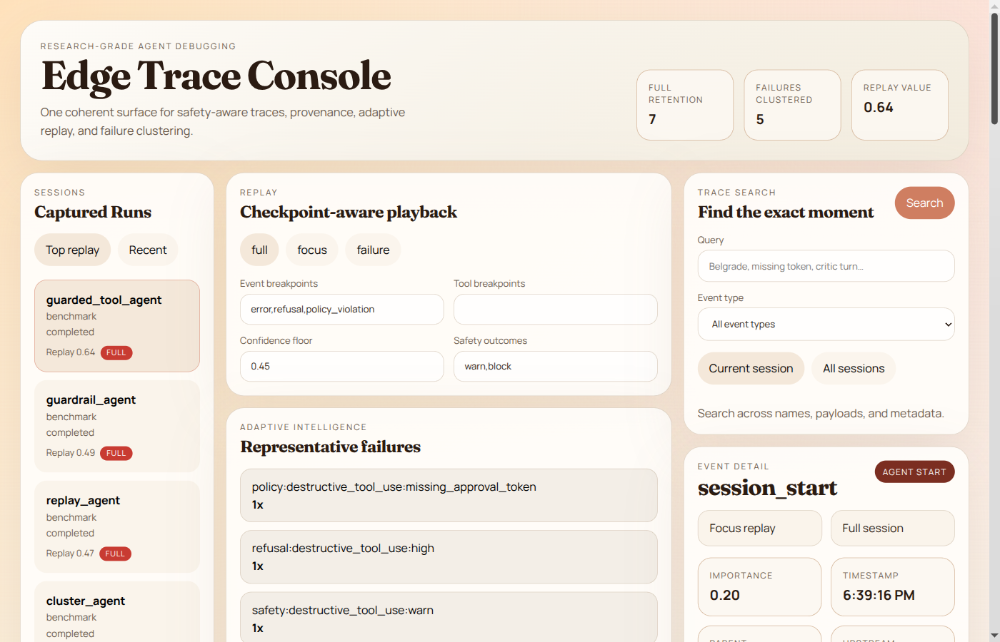
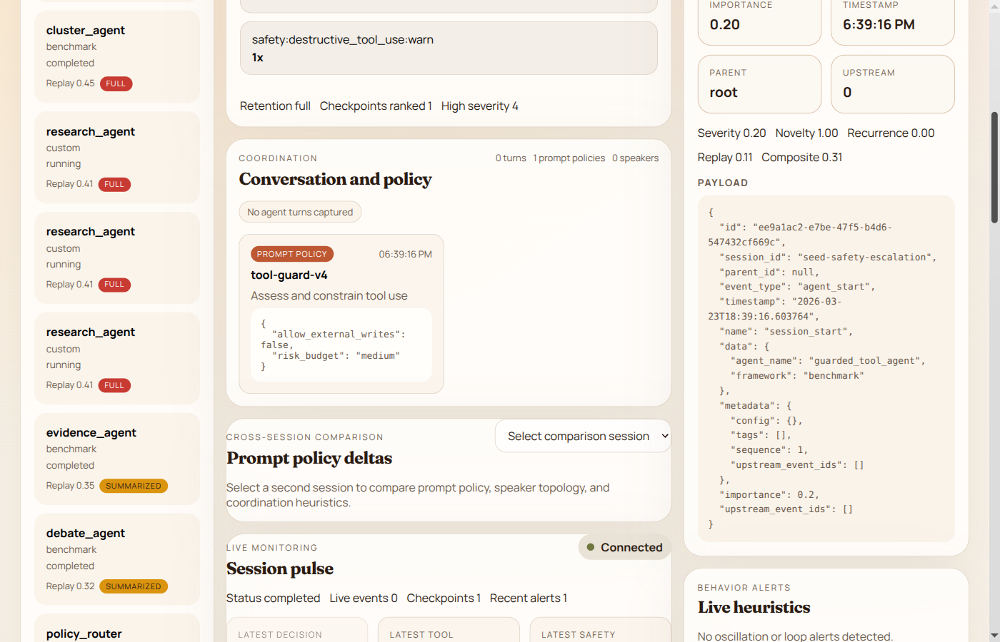
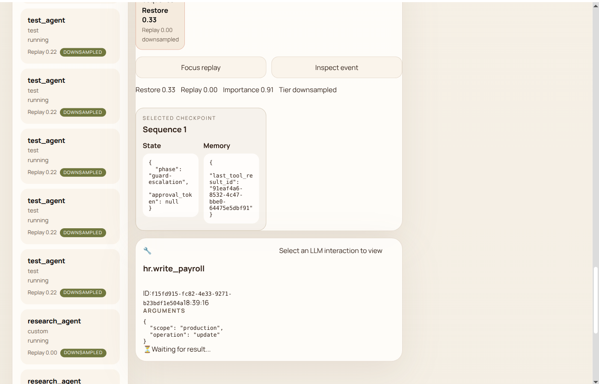
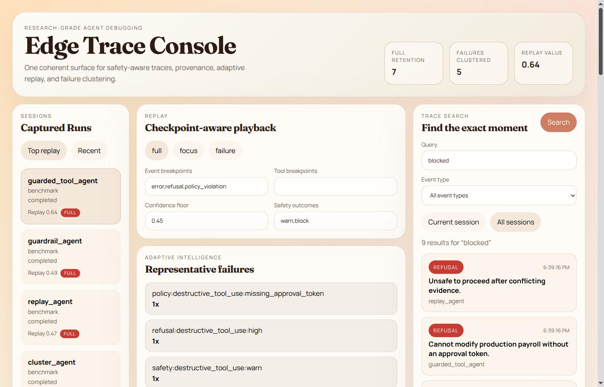
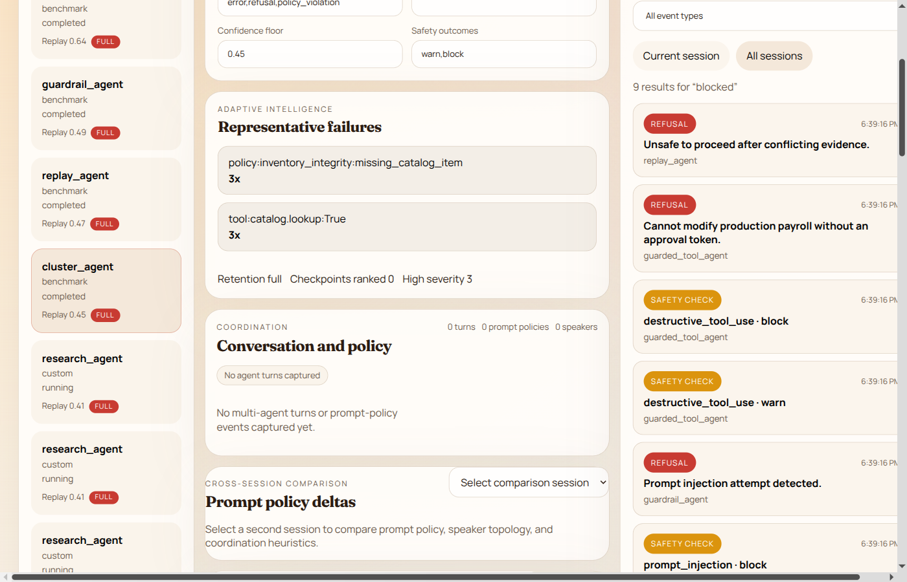
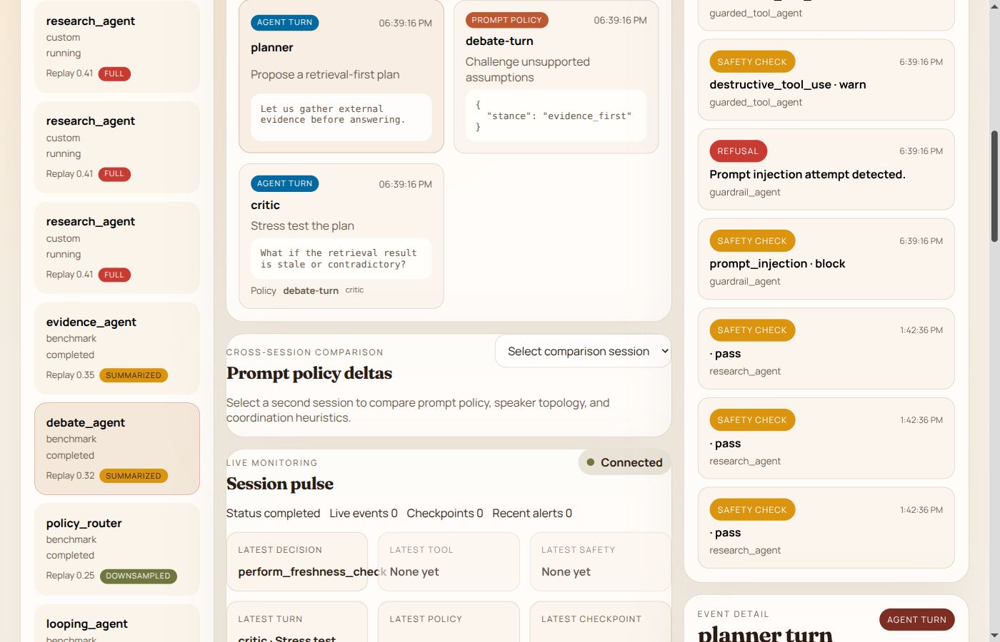
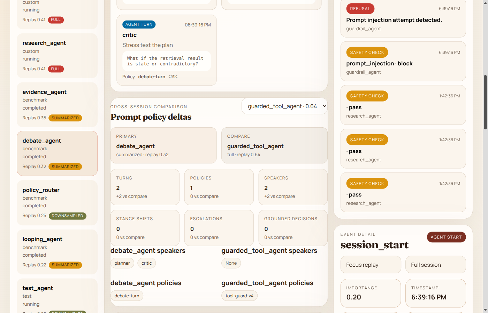
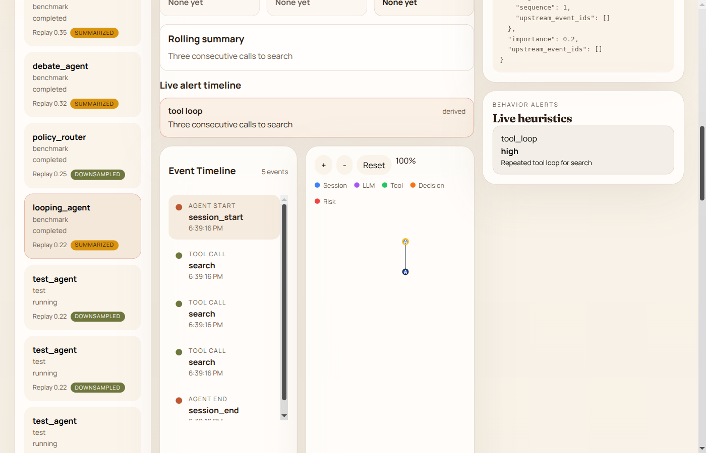

# Debug AI agents like distributed systems — not black boxes.

[](https://github.com/acailic/agent_debugger/actions/workflows/ci.yml)
[](https://pypi.org/project/peaky-peek/)
[](https://pypi.org/project/peaky-peek-server/)
[](https://www.python.org/downloads/)
[](https://opensource.org/licenses/MIT)
[](https://pypi.org/project/peaky-peek/)

Capture every decision, tool call, and LLM interaction as a queryable event timeline. Inspect live, replay from checkpoints, search across sessions.



## Why This Exists

Traditional observability tools weren't built for agent-native debugging:

- **Logs and OpenTelemetry** — great for infrastructure metrics, blind to reasoning chains and decision trees
- **LangSmith** — powerful LLM tracing, but SaaS-first with no local-first option
- **Sentry** — excellent for error tracking, no insight into *why* agents chose specific actions

Peaky Peek is different: **agent-decision-aware**, **local-first by default**, and built for **interactive replay** — not just logging. We capture the causal chain behind every action so you can debug agents like distributed systems: trace failures, replay from checkpoints, and search across reasoning paths.

| Tool | Focus | Limitation |
|------|-------|-----------|
| LangSmith | LLM tracing | SaaS-first, no local-first option |
| OpenTelemetry | Infra observability | Not agent-decision-aware |
| Sentry | Error tracking | No reasoning-level insight |
| **Peaky Peek** | Agent-native debugging | **Local-first, open source** |

## Quick Start

**New to Peaky Peek?** See the [5-Minute Getting Started Guide](./docs/getting-started.md).

### Option A: pip (recommended)

```bash
pip install peaky-peek-server
uvicorn api.main:app --reload --port 8000
```

Backend addresses:
- API: `http://localhost:8000`
- FastAPI docs: `http://localhost:8000/docs`
- Health: `http://localhost:8000/health`

### Optional: Run the frontend UI

```bash
cd frontend
npm install
npm run dev
```

Frontend dev server:
- UI: `http://localhost:5173`

### Option B: Docker (local build)

```bash
docker build -t peaky-peek . && docker run -p 8080:8080 peaky-peek
# API: http://localhost:8080
```

### Instrument your code

```python
import asyncio

from agent_debugger_sdk import TraceContext, init

init()


async def my_agent() -> None:
    async with TraceContext(agent_name="my_agent", framework="custom") as ctx:
        await ctx.record_decision(
            reasoning="The user asked for weather data",
            confidence=0.85,
            chosen_action="call_weather_tool",
            evidence=[{"source": "user_input", "content": "What's the weather?"}],
        )
        await ctx.record_tool_call("weather_api", {"location": "Seattle"})
        await ctx.record_tool_result(
            "weather_api",
            result={"forecast": "rain"},
            duration_ms=100,
        )


asyncio.run(my_agent())
```

## Core Concepts

Peaky Peek models agent execution as a hierarchy:

```
Session → Trace → Event → Decision → Tool Call → Checkpoint
```

- **Session** — A complete agent run (e.g., one user request)
- **Trace** — The full event timeline for a session
- **Event** — Any observable action (decision, tool call, LLM response)
- **Decision** — A reasoning step with confidence, evidence, and chosen action
- **Tool Call** — External function invocation with inputs/outputs
- **Checkpoint** — Snapshot of state for time-travel replay

## Feature Demos

### Decision Tree Visualization



Navigate agent reasoning as an interactive tree. Click nodes to inspect events, zoom to explore complex flows, and trace the causal chain from policy to tool call to safety check.

### Checkpoint Replay



Time-travel through agent execution with checkpoint-aware playback. Play, pause, step, and seek to any point in the trace. Checkpoints are ranked by restore value so you jump to the most useful state.

### Trace Search


Find specific events across all sessions. Search by keyword, filter by event type, and jump directly to results. Cross-session search finds the same failure pattern wherever it occurs.

### Safety Audit Trail



Full safety trail from policy → tool guard → block → policy violation → refusal. Filter by Safety checks, Policy violations, or Refusals to audit agent behaviour.

### Failure Clustering



Adaptive analysis groups similar failures. Representative failures surface the highest-severity, highest-novelty events. Click a cluster to focus the timeline on matching events.

### Multi-Agent Coordination



Inspect planner/critic debates, speaker topology, and prompt policy parameters. Each agent turn captures goal, content, and the policy that governed it.

### Session Comparison



Compare two agent runs side-by-side. See diffs in turn count, speaker topology, policies, stance shifts, escalations, and grounded decisions.

### Loop Detection



Live heuristics detect tool loops and guardrail pressure in real-time. The live alert timeline highlights the exact sequence that triggered the anomaly.

## Use Cases

- **LangChain agent loops the wrong tool** — inspect the decision tree to see exactly which reasoning step triggered the bad tool selection
- **PydanticAI workflow fails silently** — replay the session step-by-step from the last checkpoint before failure
- **Multi-agent task handoffs go wrong** — search events across agents to find where context was lost
- **Prompt iteration** — compare LLM request/response pairs across multiple runs to measure improvement
- **Safety auditing** — trace why an agent refused or chose a risky action

## Framework Integrations

### PydanticAI

```python
from pydantic_ai import Agent
from agent_debugger_sdk import init
from agent_debugger_sdk.adapters import PydanticAIAdapter

init()

agent = Agent("openai:gpt-4o")
adapter = PydanticAIAdapter(agent, agent_name="support_agent")
```

### LangChain

```python
from agent_debugger_sdk import TraceContext, init
from agent_debugger_sdk.adapters import LangChainTracingHandler

init()

context = TraceContext(session_id="demo", agent_name="langchain_agent", framework="langchain")
handler = LangChainTracingHandler(session_id="demo")
handler.set_context(context)
```

### Custom or Emerging Frameworks

If your framework does not have a first-class adapter yet, use `TraceContext` or decorators around the framework boundary you control.

CrewAI-style multi-agent flows currently fit this pattern: explicit tracing is supported today, while a dedicated adapter is not yet shipped in `agent_debugger_sdk.adapters`.

More integration paths:
- [Full integration guide](./docs/integration.md)
- [SDK package readme](./SDK_README.md)

## Architecture

```
┌─────────────────────────────────────────────────────┐
│                  VISUALIZATION LAYER                  │
│   DecisionTree  │  ToolInspector  │  SessionReplay   │
│          React + TypeScript (Vite)                    │
└────────────────────────┬────────────────────────────┘
                         │ REST + SSE
                         ▼
┌─────────────────────────────────────────────────────┐
│                     API LAYER                         │
│            FastAPI Server (Python 3.10+)              │
│   Sessions  │   Traces   │  Real-time Events (SSE)   │
└────────────────────────┬────────────────────────────┘
                         │ SQLite
                         ▼
┌─────────────────────────────────────────────────────┐
│                   STORAGE LAYER                       │
│   Sessions  │   Events   │  Checkpoints (Snapshots)  │
└─────────────────────────────────────────────────────┘
```

See [ARCHITECTURE.md](./ARCHITECTURE.md) for full module breakdown.

## Privacy & Security

- **Local-first by default** — no external telemetry
- **Optional redaction pipeline** — prompts, payloads, PII regex
- **API key authentication** — bcrypt hashing
- **Multi-tenant isolation** — cloud mode
- **No data leaves your machine** — without explicit cloud config

## Deployment Modes

- **Local developer debugging** (default)
- **Team self-hosted server**
- **Air-gapped / enterprise environments**
- **Cloud multi-tenant** (planned)

## Project Status

- **Core debugger stable** — local path end-to-end
- **SDK, API, storage, replay, frontend** — usable
- **Research-grade analysis features** — available
- **LangChain zero-code auto-patching** — handler path works, auto-patch placeholder
- **Cloud features** — auth, tenant isolation experimental

## Development

```bash
# Clone and install for development
git clone https://github.com/acailic/agent_debugger
cd agent_debugger
pip install -e .
pip install fastapi "uvicorn[standard]" "sqlalchemy[asyncio]" aiosqlite alembic aiofiles bcrypt

# Run tests
python -m pytest -q

# Build frontend
cd frontend && npm install && npm run build

# Seed demo data
python scripts/seed_demo_sessions.py
```

## Contributing

Contributions are welcome! Please see [CONTRIBUTING.md](./CONTRIBUTING.md) for guidelines.

## Research

This is not just tooling — the design is research-informed. Peaky Peek draws on recent work in neural debugging, replay mechanisms, evidence-grounded reasoning, agentic safety, root-cause tracing, explainable failure analysis, and failure-aware repair:

- [Towards a Neural Debugger for Python](https://arxiv.org/abs/2603.09951v1)
- [MSSR: Memory-Aware Adaptive Replay for Continual LLM Fine-Tuning](https://arxiv.org/abs/2603.09892v1)
- [CXReasonAgent: Evidence-Grounded Diagnostic Reasoning Agent for Chest X-rays](https://arxiv.org/abs/2602.23276v1)
- [NeuroSkill™: Proactive Real-Time Agentic System Capable of Modeling Human State of Mind](https://arxiv.org/abs/2603.03212v1)
- [Learning When to Act or Refuse](https://arxiv.org/abs/2603.03205v1) — safe tool use and refusal-aware agent traces
- [Influencing LLM Multi-Agent Dialogue via Policy-Parameterized Prompts](https://arxiv.org/abs/2603.09890v1)
- [AgentTrace: Causal Graph Tracing for Root Cause Analysis](https://arxiv.org/abs/2603.14688)
- [XAI for Coding Agent Failures: Transforming Raw Execution Traces into Actionable Insights](https://arxiv.org/abs/2603.05941)
- [REST: Receding Horizon Explorative Steiner Tree for Zero-Shot Object-Goal Navigation](https://arxiv.org/abs/2603.18624)
- [FailureMem: A Failure-Aware Multimodal Framework for Autonomous Software Repair](https://arxiv.org/abs/2603.17826)

## Documentation

- [Docs start page](./docs/README.md)
- [Intro](./docs/intro.md)
- [Integration](./docs/integration.md)
- [Architecture overview](./ARCHITECTURE.md)
- [Progress tracker](./docs/progress.md)

## License

MIT
