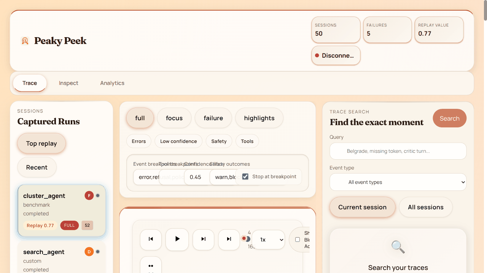
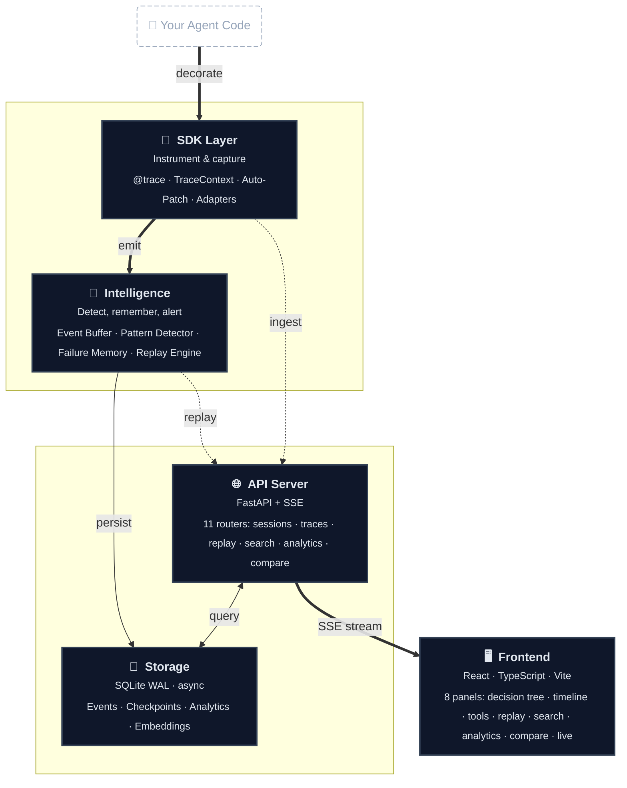
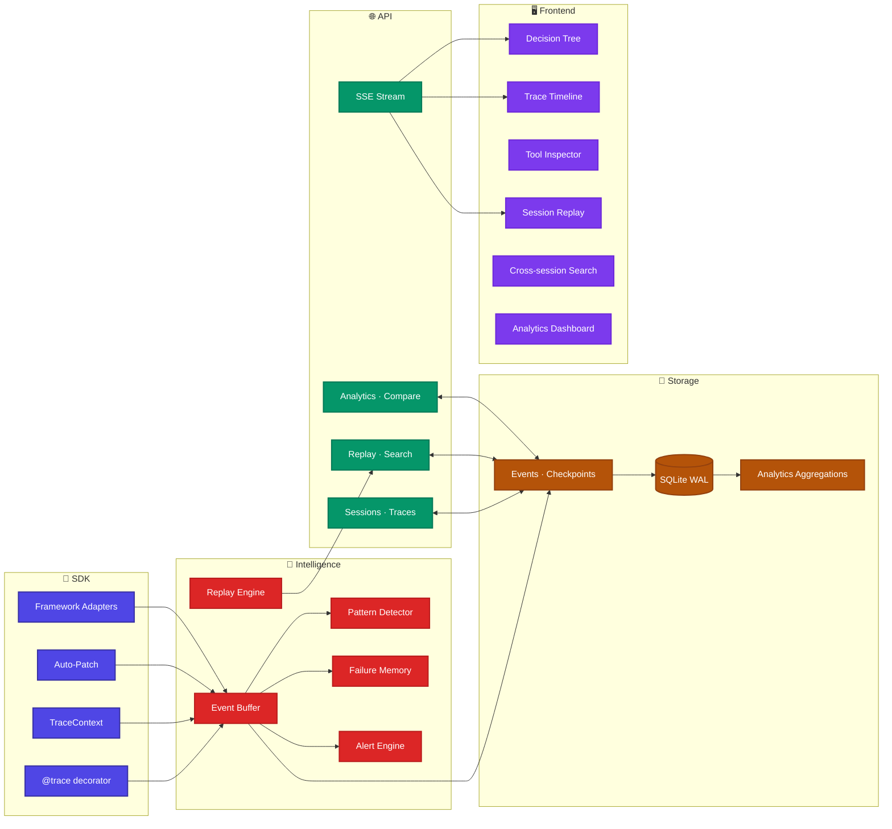

<p align="center">
  
</p>

<h1 align="center">Local-first agent debugger with replay, failure memory, smart highlights, and drift detection.</h1>

<p align="center">
  <code>pip install peaky-peek-server && peaky-peek --open</code>
</p>

<p align="center">
  <strong>Local-first, open-source agent debugger.</strong> Capture decisions, replay from checkpoints, visualize reasoning trees — all on your machine, no data sent anywhere.
</p>

<p align="center">
  <a href="https://pypi.org/project/peaky-peek/"></a>
  <a href="https://pypi.org/project/peaky-peek-server/"></a>
  
  <a href="https://opensource.org/licenses/MIT"></a>
  <a href="https://github.com/acailic/agent_debugger/actions/workflows/ci.yml"></a>
  
</p>

---

## Why Peaky Peek?

Traditional observability tools weren't built for agent-native debugging:

| Tool | Focus | Problem |
|------|-------|---------|
| LangSmith | LLM tracing | SaaS-first, your data leaves your machine |
| OpenTelemetry | Infra metrics | Blind to reasoning chains and decision trees |
| Sentry | Error tracking | No insight into *why* agents chose specific actions |
| **Peaky Peek** | **Agent-native debugging** | **Local-first, open source, privacy by default** |

Peaky Peek captures the **causal chain** behind every action so you can debug agents like distributed systems: trace failures, replay from checkpoints, and search across reasoning paths.

---

## Quick Start

### Option 1: Decorator (simplest)

```bash
pip install peaky-peek-server
peaky-peek --open   # launches API + UI at http://localhost:8000
```

```python
from agent_debugger_sdk import trace

@trace
async def my_agent(prompt: str) -> str:
    # Your agent logic here — traces are captured automatically
    return await llm_call(prompt)
```

### Option 2: Context Manager

```python
from agent_debugger_sdk import trace_session

async with trace_session("weather_agent") as ctx:
    await ctx.record_decision(
        reasoning="User asked for weather",
        confidence=0.9,
        chosen_action="call_weather_api",
        evidence=[{"source": "user_input", "content": "What's the weather?"}],
    )
    await ctx.record_tool_call("weather_api", {"city": "Seattle"})
    await ctx.record_tool_result("weather_api", result={"temp": 52, "forecast": "rain"})
```

### Option 3: Zero-Config Auto-Patch (no code changes)

```bash
# Set env var, then run your agent normally
PEAKY_PEEK_AUTO_PATCH=true python my_agent.py
```

Works with **PydanticAI, LangChain, OpenAI SDK, CrewAI, AutoGen, LlamaIndex, and Anthropic** — no imports or decorators needed.

---

## Framework Integrations

### PydanticAI

```python
from pydantic_ai import Agent
from agent_debugger_sdk import init
from agent_debugger_sdk.adapters import PydanticAIAdapter

init()

agent = Agent("openai:gpt-4o")
adapter = PydanticAIAdapter(agent, agent_name="support_agent")
```

### LangChain

```python
from agent_debugger_sdk import init
from agent_debugger_sdk.adapters import LangChainTracingHandler

init()

handler = LangChainTracingHandler(session_id="my-session")
# Pass handler to your LangChain agent's callbacks
```

### OpenAI SDK

No code needed — just set the environment variable:

```bash
PEAKY_PEEK_AUTO_PATCH=true python my_openai_agent.py
```

Or use the simplified decorator:

```python
from agent_debugger_sdk import trace

@trace(name="openai_agent", framework="openai")
async def my_agent(prompt: str) -> str:
    client = openai.AsyncOpenAI()
    response = await client.chat.completions.create(
        model="gpt-4o", messages=[{"role": "user", "content": prompt}]
    )
    return response.choices[0].message.content
```

### Auto-Patch (Any Framework)

```python
import agent_debugger_sdk.auto_patch  # activates on import when PEAKY_PEEK_AUTO_PATCH is set

# Now run your agent normally — all LLM calls are traced automatically
```

---

## Features

### Decision Tree Visualization

<p>
  
</p>

Navigate agent reasoning as an interactive tree. Click nodes to inspect events, zoom to explore complex flows, and trace the causal chain from policy to tool call to safety check.

### Checkpoint Replay

<p>
  
</p>

Time-travel through agent execution with checkpoint-aware playback. Play, pause, step, and seek to any point in the trace. Checkpoints are ranked by restore value so you jump to the most useful state.

### Trace Search

<p>
  
</p>

Find specific events across all sessions. Search by keyword, filter by event type, and jump directly to results.

### Failure Clustering & Multi-Agent Coordination

<p>
  
</p>

Adaptive analysis groups similar failures. Inspect planner/critic debates, speaker topology, and prompt policy parameters across multi-agent systems.

### Session Comparison

<p>
  
</p>

Compare two agent runs side-by-side. See diffs in turn count, speaker topology, policies, stance shifts, and grounded decisions.

---

## Privacy & Security

- **Local-first by default** — no external telemetry, no data leaves your machine
- **Zero-config auto-patching** — no credentials or API keys needed for local debugging
- **Optional redaction pipeline** — prompts, payloads, PII regex
- **API key authentication** — bcrypt hashing
- **GDPR/HIPAA friendly** — SQLite storage, no cloud dependency

## Deployment

### pip (recommended)

```bash
pip install peaky-peek-server
peaky-peek --open
```

### Docker

```bash
docker build -t peaky-peek .
docker run -p 8000:8000 -v ./traces:/app/traces peaky-peek
```

### Development

```bash
git clone https://github.com/acailic/agent_debugger
cd agent_debugger
pip install -e ".[dev]"
pip install fastapi "uvicorn[standard]" "sqlalchemy[asyncio]" aiosqlite alembic aiofiles bcrypt
python3 -m pytest -q
cd frontend && npm install && npm run build
```

---

## Architecture

### System Overview



### Layer Detail



See [ARCHITECTURE.md](./ARCHITECTURE.md) for full module breakdown.

---

## Project Status

- **Core debugger** — local path end-to-end, stable
- **SDK** — `@trace`, `trace_session()`, auto-patch for 7 frameworks
- **API** — 11 routers: sessions, traces, replay, search, analytics, cost, comparison
- **Frontend** — 8 specialized panels (decision tree, replay, checkpoints, search)
- **Tests** — 365+ passing, CI on Python 3.10/3.11/3.12

---

## Scientific Foundations

Peaky Peek is informed by research on agent debugging, causal tracing, failure analysis, and adaptive replay. See [paper notes](./docs/papers/README.md) for design takeaways from each.

- [AgentTrace: Causal Graph Tracing for Root Cause Analysis](./docs/papers/agenttrace-causal-graph-tracing-for-root-cause-analysis.md)
- [XAI for Coding Agent Failures](./docs/papers/xai-for-coding-agent-failures.md)
- [FailureMem: Failure-Aware Autonomous Software Repair](./docs/papers/failuremem-failure-aware-autonomous-software-repair.md)
- [MSSR: Memory-Aware Adaptive Replay](./docs/papers/mssr-memory-aware-adaptive-replay.md)
- [Learning When to Act or Refuse](./docs/papers/learning-when-to-act-or-refuse.md)
- [Policy-Parameterized Prompts](./docs/papers/policy-parameterized-prompts.md)
- [CXReasonAgent: Evidence-Grounded Diagnostic Reasoning](./docs/papers/cxreasonagent-evidence-grounded-diagnostic-reasoning.md)
- [NeuroSkill: Proactive Real-Time Agentic System](./docs/papers/neuroskill-proactive-real-time-agentic-system.md)
- [REST: Receding Horizon Explorative Steiner Tree](./docs/papers/rest-receding-horizon-explorative-steiner-tree.md)
- [Towards a Neural Debugger for Python](./docs/papers/towards-a-neural-debugger-for-python.md)

## Documentation

- [5-Minute Getting Started](./docs/getting-started.md)
- [Integration Guide](./docs/integration.md)
- [SDK README](./SDK_README.md)
- [Architecture Overview](./ARCHITECTURE.md)
- [Progress Tracker](./docs/progress.md)

---

## Contributing

Contributions are welcome! See [CONTRIBUTING.md](./CONTRIBUTING.md) for guidelines.

---

## License

MIT
