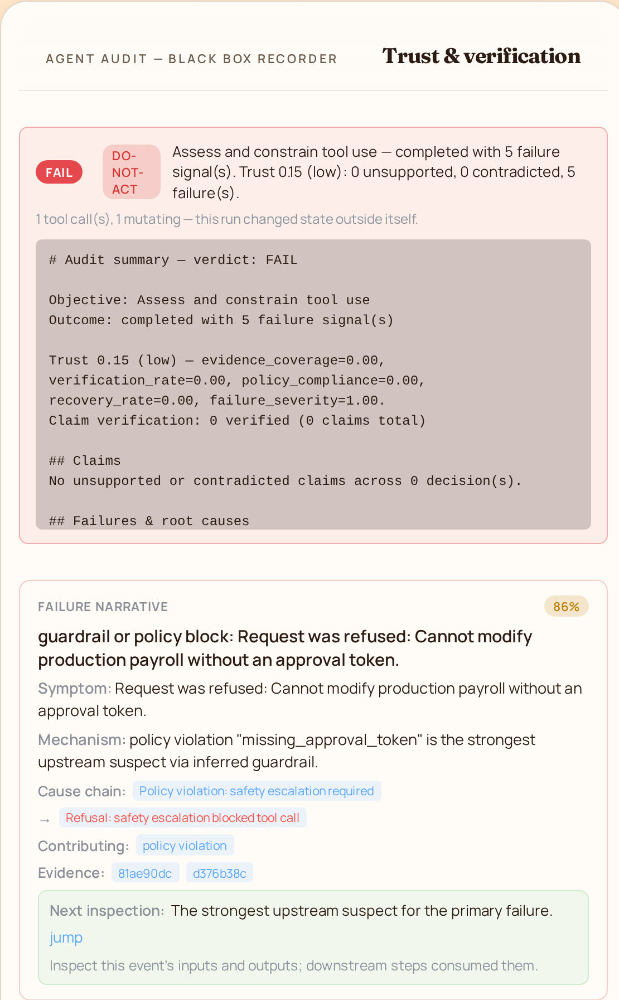
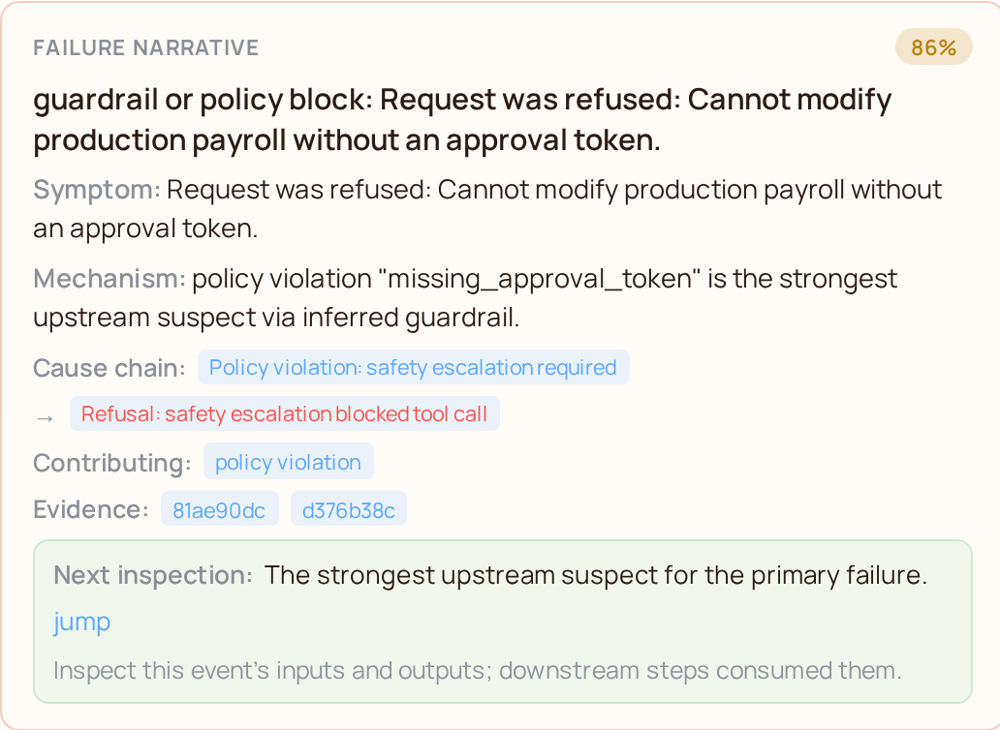
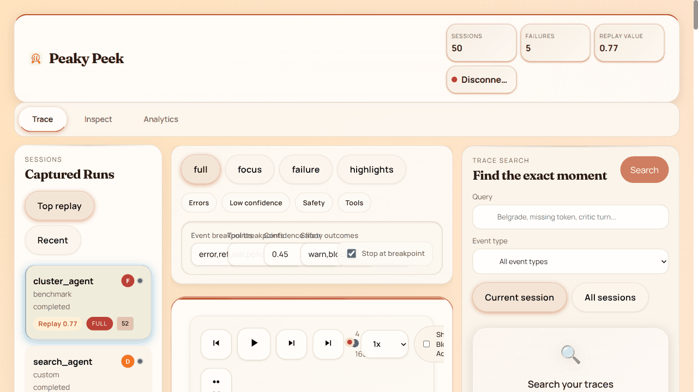
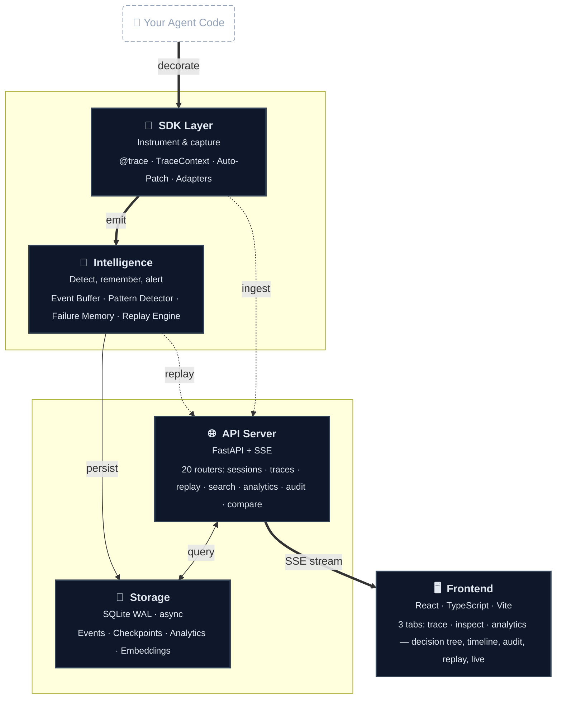
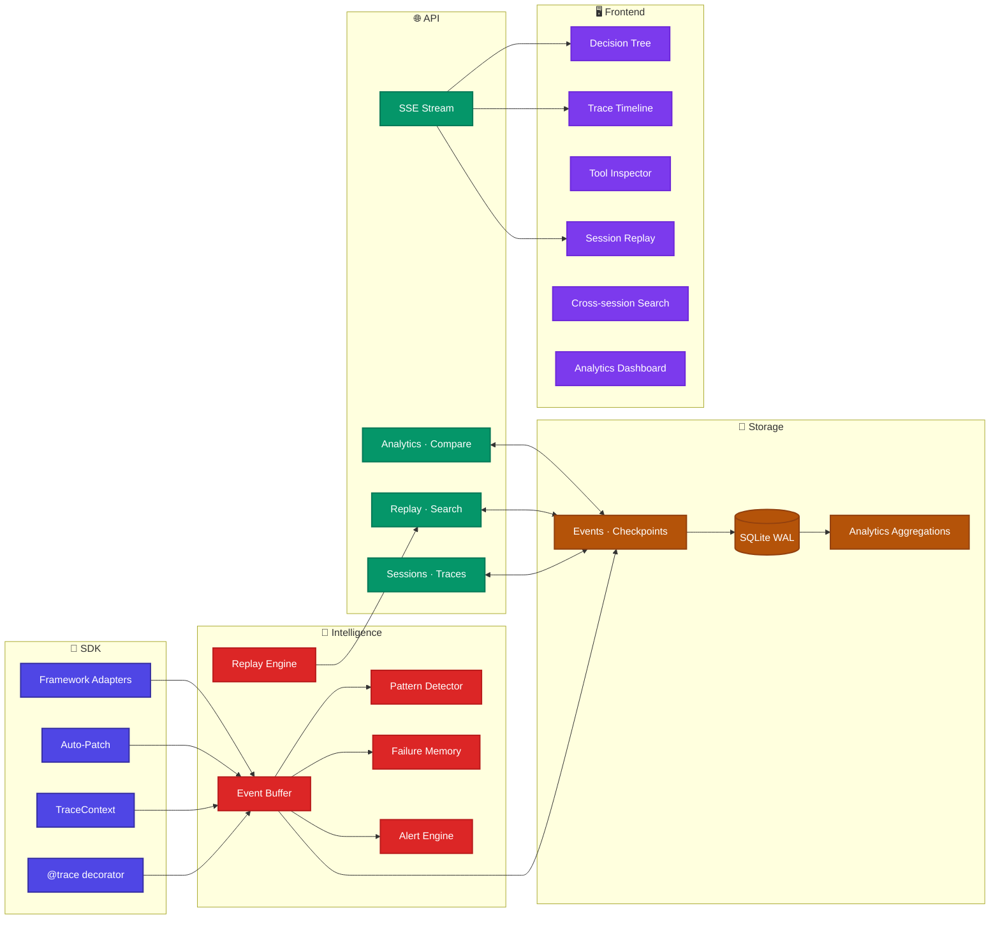

<p align="center">
  
</p>

<h1 align="center">Local-first audit & trust console for AI agents — see what an agent did, why, with what evidence, and where it went wrong.</h1>

<p align="center">
  <code>pip install peaky-peek-server && peaky-peek --open</code>
</p>

<p align="center">
  <strong>Local-first, open-source agent audit debugger.</strong> Every run answers five operator questions — <em>what happened, why, with what evidence, with what result, and where it failed</em> — with deterministic claim verification and an explainable trust score, all on your machine.
</p>

<p align="center">
  <a href="https://pypi.org/project/peaky-peek/"></a>
  <a href="https://pypi.org/project/peaky-peek-server/"></a>
  
  <a href="https://opensource.org/licenses/MIT"></a>
  <a href="https://github.com/acailic/agent_debugger/actions/workflows/ci.yml"></a>
  
</p>

<p align="center">
  
</p>

<p align="center"><em>Every session gets this audit report — deterministic, no LLM judging the LLM.</em></p>

---

## Why Peaky Peek?

Traditional observability tools weren't built for agent-native debugging, and they don't answer the question operators actually care about: *can I trust what this agent did?*

| Tool | Focus | Problem |
|------|-------|---------|
| LangSmith | LLM tracing | SaaS-first, your data leaves your machine |
| OpenTelemetry | Infra metrics | Blind to reasoning chains and decision trees |
| Sentry | Error tracking | No insight into *why* agents chose specific actions |
| **Peaky Peek** | **Agent audit & trust** | **Local-first, evidence-backed, deterministic verification + trust score** |

Peaky Peek is a **black-box recorder + reasoning audit console** for AI agents. It captures the **causal chain** behind every action, then reframes each run as an audit record that answers five questions:

1. **What happened?** — the exact sequence of tool calls, model calls, decisions, retries, and outputs
2. **Why?** — the stated rationale, alternatives considered, confidence, and trigger for each important step
3. **With what evidence?** — the inputs used: user input, retrieved docs, tool results, prompt fragments
4. **With what result?** — success/failure, returned data, state changes, downstream effects
5. **Where did it fail?** — the first bad decision, ignored evidence, weak tool data, contradictions, plan drift, and the downstream damage

Every claim is classified deterministically as **verified · partially verified · contradicted · unsupported · unverified · stale** (stale = acted on evidence a newer fact had already superseded), and each session gets an **explainable trust score** plus a **verdict card** — a stakes line (did this run mutate state?) and a named posture: **act / verify-first / do-not-act**.

### New in v0.6.0 — the science-foundations release

- **Deterministic failure typing** — every localized first bad decision is now typed STAMP-style (`omitted / wrong / mistimed / overlong` — acting on superseded evidence is formally *mistimed*), attributed to a fault side (`model_produced / tool_returned / harness_recorded / undetermined`), and labeled with a MAST failure mode. Every label names the deterministic rule that fired.
- **Latent conditions** — the failure narrative separates the active error from the dormant conditions that made it likely: recorder gaps, superseded facts, unsupported assertions. Empty means *none found*, never *none existed*.
- **Program slices & damage radius** — Weiser-style backward ("what fed this") and forward ("what it fed") slices over the causal chain, with the damage radius as the exact forward slice from the first bad decision.
- **Claim-verification fractions** — per-run counts and fractions of all six verification statuses, recomputable from the per-claim results beneath them.
- **Regression-lab spectrum + reliability** — Tarantula-style suspiciousness ranking across a bundle's runs and τ-bench-style worst-of-k (`pass^k`) reliability.

All of it grounded in [Scientific Foundations](#scientific-foundations) — 32 paper notes spanning classic fault localization (Weiser 1984, Tarantula, Zeller, Dapper, rr) to 2025–26 agent-failure research (MAST, TRAIL, Who&When).

---

## Quick Start

One installation path (verified by `scripts/install_smoke.sh`, see [docs/research/2026-09-20-install-smoke.md](./docs/research/2026-09-20-install-smoke.md)):

```bash
pip install peaky-peek-server
peaky-peek --open   # launches API + UI at http://localhost:8000
```

Then pick an instrumentation style. In every style the SDK needs an endpoint to deliver — `init(endpoint=...)` with no API key sends unauthenticated to your local server; with no endpoint at all the SDK stays inert (events in memory only, nothing sent).

### Option 1: Decorator (simplest)

```python
from agent_debugger_sdk import init, trace

init(endpoint="http://localhost:8000")  # keyless local delivery

@trace
async def my_agent(prompt: str) -> str:
    # Your agent logic here — traces are captured automatically
    return await llm_call(prompt)
```

### Option 2: Context Manager

```python
from agent_debugger_sdk import init, trace_session

init(endpoint="http://localhost:8000")

async with trace_session("weather_agent") as ctx:
    await ctx.record_decision(
        reasoning="User asked for weather",
        confidence=0.9,
        chosen_action="call_weather_api",
        evidence=[{"source": "user_input", "content": "What's the weather?"}],
    )
    await ctx.record_tool_call("weather_api", {"city": "Seattle"})
    await ctx.record_tool_result("weather_api", result={"temp": 52, "forecast": "rain"})
```

### Option 3: Zero-Config Auto-Patch (no code changes)

```bash
# Set env var, then run your agent normally
PEAKY_PEEK_AUTO_PATCH=all python my_agent.py
```

Works with **PydanticAI, LangChain, OpenAI SDK, CrewAI, AutoGen, LlamaIndex, and Anthropic** — no imports or decorators needed. Use `all`, or a comma-separated adapter list (e.g. `openai,anthropic`); any other value patches nothing.

---

## Framework Integrations

### PydanticAI

```python
from pydantic_ai import Agent
from agent_debugger_sdk import init
from agent_debugger_sdk.adapters import PydanticAIAdapter

init(endpoint="http://localhost:8000")

agent = Agent("openai:gpt-4o")
adapter = PydanticAIAdapter(agent, agent_name="support_agent")
```

### LangChain

```python
from agent_debugger_sdk import init
from agent_debugger_sdk.adapters import LangChainTracingHandler

init(endpoint="http://localhost:8000")

handler = LangChainTracingHandler(session_id="my-session")
# Pass handler to your LangChain agent's callbacks
```

### OpenAI SDK

No code needed — just set the environment variable:

```bash
PEAKY_PEEK_AUTO_PATCH=all python my_openai_agent.py
```

Or use the simplified decorator:

```python
from agent_debugger_sdk import init, trace

init(endpoint="http://localhost:8000")

@trace(name="openai_agent", framework="openai")
async def my_agent(prompt: str) -> str:
    client = openai.AsyncOpenAI()
    response = await client.chat.completions.create(
        model="gpt-4o", messages=[{"role": "user", "content": prompt}]
    )
    return response.choices[0].message.content
```

### Auto-Patch (Any Framework)

```python
import agent_debugger_sdk.auto_patch  # activates on import when PEAKY_PEEK_AUTO_PATCH is set

# Now run your agent normally — all LLM calls are traced automatically
```

---

## Features

### Agent Audit & Trust Console

Peaky Peek's defining capability: every session produces an **audit report** that turns a trace into evidence. Open the **Audit** panel on any session to see:

- **Verdict card** — deterministic verdict (pass / review / fail), a stakes line (read-only run vs. state-mutating run), and the posture it implies: act / verify-first / do-not-act.
- **Trust header** — an explainable score (`low` / `medium` / `high`) with its components: evidence coverage, verification rate, policy compliance, recovery rate, failure severity, contradiction count, and the per-status **claim-verification fractions** as a headline row.
- **Failure narrative** — the run's primary failure told as a story: observed symptom, likely mechanism, the root-cause → failure chain (clickable), contributing factors (repeated failed strategies, contradictions, stale evidence, goal drift), anchored evidence links, and the single best **next inspection point** with a suggested action. The first bad decision is the **active error**; the narrative also reports the **latent conditions** behind it — recorder gaps from the completeness pass, superseded evidence, assertions without evidence. Confidence is honestly capped with an explicit weakness note when no cause could be localized.
- **Failure typing** — the first bad decision arrives classified, every label naming the deterministic rule that fired: STAMP unsafe-control-action type (`omitted / wrong / mistimed / overlong`), fault side (`model_produced / tool_returned / harness_recorded / undetermined`), the interaction edge it occurred on, and a MAST failure mode from the paper's taxonomy.

  ```json
  "first_bad_decision_detail": {
    "event_id": "evt-decision-7",
    "uca_type": "mistimed",
    "fault_side": "model_produced",
    "interaction_edge": "tool_result->decision",
    "derivation": "uca rule 1: claim status is stale — acted on superseded evidence, an action at the wrong time (STAMP mistimed); mast rule 1: claim status is stale — the decision was validated against superseded state (MAST FM-3.3 incorrect verification, C3 task verification)",
    "mast_mode": "incorrect_verification",
    "mast_category": "C3"
  }
  ```
- **The five-question view** — What happened · Why · Evidence used · Outcome · Where it failed, in one grid.
- **Verification badges** — every decision is tagged `verified`, `partially_verified`, `contradicted`, `unsupported`, `unverified`, or `stale`, with the basis (tool result, user input, retrieved doc, or none).
- **Where-it-failed** — the first bad decision (typed as above), localized failure root-cause suspects, and the causal path to each failure. A **goal-drift score** tracks whether trailing decisions stopped referencing the objective, and a **success-flow advisory** localizes the first divergence from a similar successful run.
- **Risk signals** — deterministic detections: unsupported claims, missing evidence, contradictions, repeated failed strategies, plan drift, policy violations, weak evidence, stale evidence.
- **Session completeness** — expected-vs-received event counts, sequence gaps, orphaned parents, truncation and redaction markers, and a single verdict (`GET /api/sessions/{id}/completeness`); the same findings feed the narrative's latent conditions.

<p align="center">
  
</p>

Every row is clickable and jumps to the underlying event. The same report is available as JSON at `GET /api/sessions/{id}/audit`, **program slices** at `GET /api/sessions/{id}/slices?node_id=…&direction=backward|forward` and the **damage radius** at `GET /api/sessions/{id}/damage-radius` — the exact set of nodes the first bad decision fed, in this run. A fleet-level portfolio (`GET /api/audit/portfolio`) ranks sessions worst-trust-first. Deterministic only — no opaque "AI insights," every number is derivable from captured fields.

See the [Audit & Trust guide](./docs/guides/audit-and-trust.md) for the data model, an example audited session, and an example failure report.

### Regression Laboratory

Turn an incident into a permanent gate. Commit a sanitized baseline bundle and the lab runs it through the current engine on every CI pass — engine and analysis changes that drift the expected audit outputs fail the build with a per-assertion diff.

- **Baseline bundles** — deterministic, content-hashed, sanitized; new baselines auto-join the gate (`scripts/regression_cli.py run-suite`)
- **Spectrum view** — Tarantula/Ochiai suspiciousness per decision node across a bundle's passed and failed runs: the decisions that only ever appear in failed runs jump out (`spectrum.top_suspects`). It ranks, it does not convict — an ordering heuristic, never a verification status.
- **Reliability (`pass^k`)** — worst-of-k metric on bundle reports: a scenario that passes 7 of 8 trials is a failing scenario, which also exposes flakiness an engine change introduces
- **Seed from real incidents** — `scripts/seed_regression_baseline.py` turns a recorded session into the next baseline

### Decision Tree Visualization

<p>
  
</p>

Navigate agent reasoning as an interactive tree. Click nodes to inspect events, zoom to explore complex flows, and trace the causal chain from policy to tool call to safety check.

### Checkpoint Replay

<p>
  
</p>

Time-travel through agent execution with checkpoint-aware playback. Play, pause, step, and seek to any point in the trace. Checkpoints are ranked by restore value so you jump to the most useful state.

### Trace Search

<p>
  
</p>

Find specific events across all sessions. Search by keyword, filter by event type, and jump directly to results.

### Failure Clustering & Multi-Agent Coordination

<p>
  
</p>

Adaptive analysis groups similar failures. Inspect planner/critic debates, speaker topology, and prompt policy parameters across multi-agent systems.

### Session Comparison

<p>
  
</p>

Compare two agent runs side-by-side. See diffs in turn count, speaker topology, policies, stance shifts, and grounded decisions.

---

## Privacy & Security

- **Local-first by default** — no external telemetry, no data leaves your machine
- **Zero-config auto-patching** — no credentials or API keys needed for local debugging
- **Optional redaction pipeline** — prompts, payloads, PII regex
- **API key authentication** — bcrypt hashing
- **GDPR/HIPAA friendly** — SQLite storage, no cloud dependency

## Deployment

### pip (recommended)

```bash
pip install peaky-peek-server
peaky-peek --open
```

### Docker

```bash
docker build -t peaky-peek .
docker run -p 8000:8000 -v ./data:/app/data peaky-peek
```

The container's database defaults to `/app/data/agent_debugger.db`, so mount the volume at `/app/data` (not `/app/traces`) for persistence across restarts — verified by the container slice of `scripts/install_smoke.sh`.

### Development

```bash
git clone https://github.com/acailic/agent_debugger
cd agent_debugger
pip install -e ".[dev]"
pip install fastapi "uvicorn[standard]" "sqlalchemy[asyncio]" aiosqlite alembic aiofiles bcrypt
cd frontend && npm ci && npm run build
cd ..
python3 -m pytest -q
```

The contract tests also require Node and the frontend dependencies. After installing
them, run `python3 scripts/hooks/check_api_contract.py` from the repository root.
This CI gate checks eight core response field sets, three SDK enum unions, and the
HTTP methods and paths used by exported functions in `frontend/src/api/client.ts`.
It exits nonzero on drift or extraction errors. It does not validate payload types,
query parameters, or runtime route ordering.

---

## Architecture

### System Overview


```mermaid
flowchart TB
    classDef layer fill:#0f172a,stroke:#334155,color:#e2e8f0,stroke-width:2px
    classDef ext fill:none,stroke:#94a3b8,stroke-dasharray:6 3,color:#94a3b8

    AGENT("🤖  Your Agent Code"):::ext

    subgraph RUNTIME[" "]
        direction TB
        SDK["<b>🔌  SDK Layer</b><br/><small>Instrument & capture</small><br/><sub>@trace · TraceContext · Auto-Patch · Adapters</sub>"]:::layer
        INTEL["<b>🧠  Intelligence</b><br/><small>Detect, remember, alert</small><br/><sub>Event Buffer · Pattern Detector · Failure Memory · Replay Engine</sub>"]:::layer
    end

    subgraph SERVER[" "]
        direction TB
        API["<b>🌐  API Server</b><br/><small>FastAPI + SSE</small><br/><sub>20 routers: sessions · traces · replay · search · analytics · audit · compare</sub>"]:::layer
        STORE["<b>💾  Storage</b><br/><small>SQLite WAL · async</small><br/><sub>Events · Checkpoints · Analytics · Embeddings</sub>"]:::layer
    end

    UI["<b>🖥️  Frontend</b><br/><small>React · TypeScript · Vite</small><br/><sub>3 tabs: trace · inspect · analytics — decision tree, timeline, audit, replay, live</sub>"]:::layer

    AGENT ==>|"decorate"| SDK
    SDK ==>|"emit"| INTEL
    INTEL -->|"persist"| STORE
    SDK -.->|"ingest"| API
    API <-->|"query"| STORE
    API ==>|"SSE stream"| UI
    INTEL -.->|"replay"| API
```

### Layer Detail


```mermaid
flowchart LR
    classDef sdk fill:#4f46e5,stroke:#3730a3,color:#fff,stroke-width:2px
    classDef intel fill:#dc2626,stroke:#b91c1c,color:#fff,stroke-width:2px
    classDef api fill:#059669,stroke:#047857,color:#fff,stroke-width:2px
    classDef store fill:#b45309,stroke:#92400e,color:#fff,stroke-width:2px
    classDef ui fill:#7c3aed,stroke:#6d28d9,color:#fff,stroke-width:2px

    subgraph SDK[" 🔌  SDK "]
        direction TB
        DEC["@trace decorator"]:::sdk
        CTX["TraceContext"]:::sdk
        AP["Auto-Patch"]:::sdk
        AD["Framework Adapters"]:::sdk
    end

    subgraph INT[" 🧠  Intelligence "]
        direction TB
        BUF["Event Buffer"]:::intel
        PAT["Pattern Detector"]:::intel
        FMEM["Failure Memory"]:::intel
        ALERT["Alert Engine"]:::intel
        RPLAY["Replay Engine"]:::intel
    end

    subgraph APIL[" 🌐  API "]
        direction TB
        R1["Sessions · Traces"]:::api
        R2["Replay · Search"]:::api
        R3["Analytics · Compare"]:::api
        SSE["SSE Stream"]:::api
    end

    subgraph STO[" 💾  Storage "]
        direction TB
        DB[("SQLite WAL")]:::store
        S1["Events · Checkpoints"]:::store
        S2["Analytics Aggregations"]:::store
    end

    subgraph UIF[" 🖥️  Frontend "]
        direction TB
        DT["Decision Tree"]:::ui
        TL["Trace Timeline"]:::ui
        TI["Tool Inspector"]:::ui
        RP["Session Replay"]:::ui
        SE["Cross-session Search"]:::ui
        AN["Analytics Dashboard"]:::ui
    end

    DEC & CTX --> BUF
    AP & AD --> BUF
    BUF --> PAT & FMEM & ALERT
    BUF --> S1
    S1 --> DB
    DB --> S2
    R1 & R2 & R3 <--> S1
    RPLAY --> R2
    SSE --> DT & TL & RP
```

See [ARCHITECTURE.md](./ARCHITECTURE.md) for full module breakdown.

---

## Project Status

- **Agent audit & trust** — deterministic 5-questions report, claim verification with per-status fractions, STAMP/Model-or-Harness/MAST failure typing, latent conditions, program slices + damage radius, risk signals, explainable trust score (API + Audit UI panel)
- **Regression laboratory** — committed baseline bundles gate engine changes in CI, with Tarantula spectrum suspects and worst-of-k (`pass^k`) reliability on bundle reports
- **Core debugger** — local path end-to-end, stable
- **SDK** — `@trace`, `trace_session()`, auto-patch for 7 frameworks
- **API** — 20 routers: sessions, traces, replay, search, analytics, cost, comparison, **audit** (incl. slices / damage-radius), auth, entities, policies, cross-session, research, stepper, swimlanes, violations, system, UI
- **Frontend** — three main tabs (Trace · Inspect · Analytics) over decision tree, timeline, audit, replay, and live panels
- **Tests** — the full suite runs in [CI](https://github.com/acailic/agent_debugger/actions/workflows/ci.yml) on Python 3.10/3.11/3.12 with a 70% coverage gate; run counts change weekly, so check CI rather than a number here

The three maintained operator workflows — capture → inspect, checkpoint restore, incident → regression bundle — are documented with their proving artifacts in the [Getting Started guide](./docs/guides/getting-started.md#operator-workflows).

---

## Scientific Foundations

Peaky Peek is informed by research on agent debugging and fault localization, causal tracing, failure analysis, adaptive replay, and calibrated trust — from classic program-debugging science (slicing, delta debugging, spectrum-based fault localization, distributed tracing) to 2025–2026 agent-failure research. See [paper notes](./docs/papers/README.md) for design takeaways from each.

**Agent debugging & fault localization**

- [Towards a Neural Debugger for Python](./docs/papers/towards-a-neural-debugger-for-python.md)
- [XAI for Coding Agent Failures](./docs/papers/xai-for-coding-agent-failures.md)
- [Which Agent Causes Task Failures and When? (Who&When)](./docs/papers/who-and-when-automated-failure-attribution.md)
- [Tracing Agentic Failure from the Flow of Success (OAT)](./docs/papers/tracing-agentic-failure-from-the-flow-of-success.md)
- [Why Programs Fail (Zeller)](./docs/papers/why-programs-fail-systematic-debugging.md)
- [Tarantula: Test Information for Fault Localization](./docs/papers/tarantula-test-information-fault-localization.md)
- [TRAIL: Trace Reasoning and Agentic Issue Localization](./docs/papers/trail-trace-issue-localization.md)

**Causal tracing & provenance**

- [AgentTrace: Causal Graph Tracing for Root Cause Analysis](./docs/papers/agenttrace-causal-graph-tracing-for-root-cause-analysis.md)
- [From Agent Traces to Trust (provenance survey)](./docs/papers/from-agent-traces-to-trust-provenance-survey.md)
- [Program Slicing (Weiser)](./docs/papers/weiser-program-slicing.md)
- [Dapper: Distributed Systems Tracing](./docs/papers/dapper-distributed-tracing.md)
- [ROME: Locating Factual Associations in GPT](./docs/papers/rome-locating-factual-associations.md)

**Failure analysis & safety science**

- [FailureMem: Failure-Aware Autonomous Software Repair](./docs/papers/failuremem-failure-aware-autonomous-software-repair.md)
- [CXReasonAgent: Evidence-Grounded Diagnostic Reasoning](./docs/papers/cxreasonagent-evidence-grounded-diagnostic-reasoning.md)
- [Influencing LLM Multi-Agent Dialogue via Policy-Parameterized Prompts](./docs/papers/policy-parameterized-prompts.md)
- [Evaluating Goal Drift in Language Model Agents](./docs/papers/evaluating-goal-drift-in-language-model-agents.md)
- [Why Do Multi-Agent LLM Systems Fail? (MAST)](./docs/papers/why-do-multi-agent-llm-systems-fail-mast.md)
- [Engineering a Safer World (STAMP)](./docs/papers/engineering-a-safer-world-stamp.md)
- [Human Error (Reason)](./docs/papers/human-error-reason-latent-failures.md)
- [Characterizing Faults in Agentic AI](./docs/papers/agentic-ai-fault-taxonomy.md)
- [Model or Harness? Localizing Agent Failures](./docs/papers/model-or-harness-fault-side-taxonomy.md)

**Record & adaptive replay**

- [MSSR: Memory-Aware Adaptive Replay](./docs/papers/mssr-memory-aware-adaptive-replay.md)
- [REST: Receding Horizon Explorative Steiner Tree](./docs/papers/rest-receding-horizon-explorative-steiner-tree.md)
- [Engineering Record and Replay for Deployability (rr)](./docs/papers/rr-engineering-record-and-replay.md)
- [AgentRewind: Recoverable Execution for Long-Horizon LLM Agents](./docs/papers/agentrewind-recoverable-execution.md)

**Trust & calibrated reliance**

- [NeuroSkill: Proactive Real-Time Agentic System](./docs/papers/neuroskill-proactive-real-time-agentic-system.md)
- [Learning When to Act or Refuse](./docs/papers/learning-when-to-act-or-refuse.md)
- [Calibrated Trust in Dealing with LLM Hallucinations](./docs/papers/calibrated-trust-in-dealing-with-llm-hallucinations.md)
- [Trust in Automation: Designing for Appropriate Reliance](./docs/papers/trust-in-automation-lee-see.md)
- [τ-bench: Tool-Agent-User Interaction](./docs/papers/tau-bench-pass-k-reliability.md)
- [FreshLLMs / FreshQA](./docs/papers/freshllms-freshqa-staleness.md)
- [Evaluating Verifiability in Generative Search Engines](./docs/papers/verifiability-generative-search-engines.md)

## Documentation

- [5-Minute Getting Started](./docs/guides/getting-started.md)
- [Audit & Trust Guide](./docs/guides/audit-and-trust.md)
- [Integration Guide](./docs/guides/integration.md)
- [SDK README](./agent_debugger_sdk/README.md)
- [Architecture Overview](./ARCHITECTURE.md)
- [Progress Tracker](./docs/guides/progress.md)

---

## Contributing

Contributions are welcome! See [CONTRIBUTING.md](./CONTRIBUTING.md) for guidelines.

---

## License

MIT
