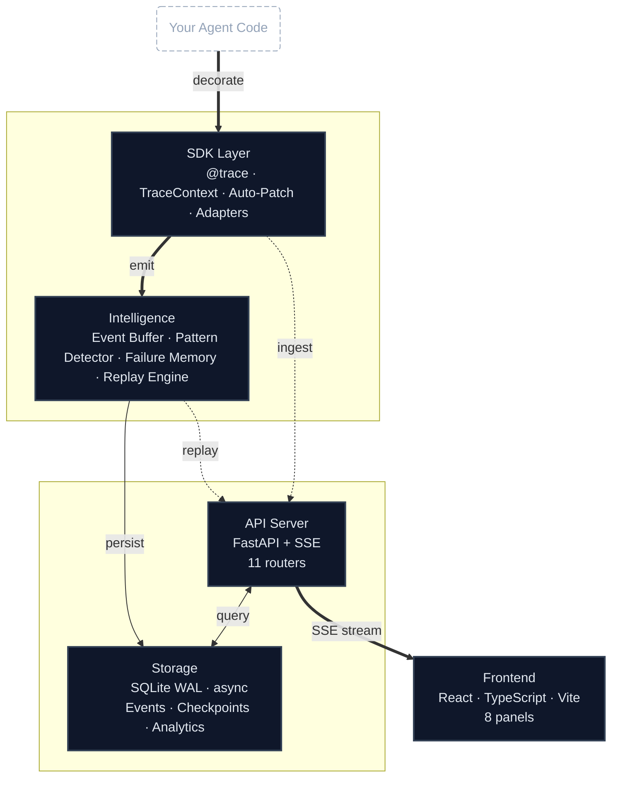

# Architecture

Peaky Peek is a trace-first debugger for AI agents. This document explains the system architecture, data flow, and design principles.

## What Peaky Peek Is

Peaky Peek captures agent execution as structured events, preserves parent/child and provenance relationships, streams events live to a UI for debugging, persists sessions/events/checkpoints to a database, and exposes replay and adaptive analysis over stored traces.

Instead of relying on plain logs, it records semantic events:

- Agent start and end
- Decisions with reasoning chains
- LLM requests and responses
- Tool calls and results
- Errors and exceptions
- Checkpoints for time-travel
- Safety checks, refusals, and policy violations
- Prompt policy state and multi-agent turns
- Behavior alerts

## System Overview



## Core Components

### SDK Layer (`agent_debugger_sdk/`)

The SDK provides framework-agnostic instrumentation for agents:

- **`core/context.py`** — TraceContext for explicit tracing
- **`core/decorators.py`** — `@trace_agent`, `@trace_tool`, `@trace_llm`
- **`core/events.py`** — Event types (ToolCall, LLMRequest, Decision)
- **`adapters/`** — Framework integrations (PydanticAI, LangChain, etc.)
- **`auto_patch/`** — Zero-code instrumentation registry
- **`config.py`** — Configuration management
- **`transport.py`** — HTTP/SSE transport helpers

### Collector Layer (`collector/`)

The collector receives, scores, buffers, and persists traces:

- **`buffer.py`** — In-memory event buffer for live streaming
- **`server.py`** — FastAPI endpoints for trace ingestion
- **`replay.py`** — Checkpoint-aware replay engine
- **`intelligence.py`** — Event ranking, failure clustering, alerts

### Storage Layer (`storage/`)

The storage layer provides efficient data persistence:

- **`engine.py`** — Database engine configuration
- **`repository.py`** — Data access layer for sessions/events/checkpoints
- **`models.py`** — SQLAlchemy models
- **`migrations/`** — Alembic database migrations

### API Layer (`api/`)

The API exposes REST and real-time interfaces:

- **`main.py`** — FastAPI application factory
- **`session_routes.py`** — Session CRUD operations
- **`trace_routes.py`** — Trace query endpoints
- **`replay_routes.py`** — Time-travel endpoints
- **`search_routes.py`** — Cross-session trace search
- **`analytics_routes.py`** — Analytics aggregations
- **`comparison_routes.py`** — Session comparison
- **`cost_routes.py`** — Token usage and cost tracking
- **`entity_routes.py`** — Entity extraction and tracking
- **`policy_routes.py`** — Prompt policy analysis
- **`cross_session_routes.py`** — Multi-agent coordination
- **`auth_routes.py`** — API key authentication
- **`system_routes.py`** — Health and system info

### Frontend (`frontend/`)

The frontend provides a React-based debugging UI:

- **Decision Tree** — Interactive tree visualization
- **Trace Timeline** — Event timeline with inspection
- **Tool Inspector** — Tool call viewer
- **Session Replay** — Time-travel controls
- **Cross-session Search** — Search across all sessions
- **Analytics Dashboard** — Aggregated metrics and insights

## Data Flow

### Event Capture Flow

1. **Instrumentation** — Agent code is decorated or wrapped with SDK
2. **Event Emission** — SDK emits typed events (AgentStart, Decision, ToolCall, etc.)
3. **Buffering** — Events are published to the in-memory EventBuffer
4. **Persistence** — Events are persisted to the database
5. **Streaming** — Live events are streamed to the UI via SSE
6. **Analysis** — Events are analyzed for patterns and failures

### Trace Context Management

The `TraceContext` uses Python's `contextvars` for async-safe state:

```python
# When a trace starts
TraceContext creates or accepts a session_id
TraceContext sets async-local state with contextvars
TraceContext creates or updates the session through persistence hooks
TraceContext emits an agent_start event

# During execution
TraceContext records decisions, tool results, errors, checkpoints
Each event has parent_id for hierarchical structure

# When trace ends
TraceContext emits an agent_end event
TraceContext updates session counters and final status
```

## Event Model

### Core Event Structure

Every event has:

- `session_id` — Identifies the agent session
- `parent_id` — Links to parent event for hierarchy
- `event_type` — Type of event (agent_start, decision, tool_call, etc.)
- `data` — Event-specific payload
- `metadata` — Additional context
- `importance` — Score (0.0-1.0) for prioritization
- `upstream_event_ids` — Provenance tracking

### Event Types

- **`agent_start`** — Agent execution begins
- **`agent_end`** — Agent execution completes
- **`decision`** — Agent decision with reasoning
- **`llm_request`** — LLM API call
- **`llm_response`** — LLM response with usage/cost
- **`tool_call`** — Tool/function invocation
- **`tool_result`** — Tool execution result
- **`error`** — Error or exception
- **`checkpoint`** — State snapshot for replay
- **`safety_check`** — Safety policy evaluation
- **`refusal`** — Agent refusal to act
- **`policy_violation`** — Policy violation detected
- **`multi_agent_turn`** — Multi-agent communication
- **`behavior_alert`** — Unexpected behavior detected

## Storage Schema

### Sessions Table

```sql
CREATE TABLE sessions (
    id TEXT PRIMARY KEY,
    agent_name TEXT NOT NULL,
    framework TEXT NOT NULL,
    started_at TIMESTAMP NOT NULL,
    ended_at TIMESTAMP,
    status TEXT NOT NULL DEFAULT 'running',
    total_tokens INTEGER DEFAULT 0,
    total_cost_usd REAL DEFAULT 0.0,
    tool_calls INTEGER DEFAULT 0,
    llm_calls INTEGER DEFAULT 0,
    errors INTEGER DEFAULT 0,
    config JSONB,
    tags JSONB
);
```

### Events Table

```sql
CREATE TABLE trace_events (
    id TEXT PRIMARY KEY,
    session_id TEXT NOT NULL REFERENCES sessions(id),
    parent_id TEXT REFERENCES trace_events(id),
    event_type TEXT NOT NULL,
    timestamp TIMESTAMP NOT NULL,
    name TEXT,
    data JSONB NOT NULL,
    metadata JSONB,
    importance REAL DEFAULT 0.5,
    sequence INTEGER NOT NULL
);
```

### Checkpoints Table

```sql
CREATE TABLE checkpoints (
    id TEXT PRIMARY KEY,
    session_id TEXT NOT NULL REFERENCES sessions(id),
    event_id TEXT NOT NULL REFERENCES trace_events(id),
    sequence INTEGER NOT NULL,
    state JSONB NOT NULL,
    memory JSONB,
    timestamp TIMESTAMP NOT NULL,
    importance REAL DEFAULT 0.5
);
```

## Replay System

### Checkpoint-Aware Replay

The replay engine supports:

1. **Full replay** — Replay from the beginning
2. **Checkpoint replay** — Replay from the nearest checkpoint before a focused event
3. **Failure replay** — Replay that jumps to the last failure-like event
4. **Breakpoint replay** — Replay with breakpoint rules on event type, tool name, confidence, and safety outcome

### Importance Scoring

Events are scored for replay value using:

- **Severity** — Errors and failures score higher
- **Novelty** — Unusual patterns score higher
- **Recurrence** — Repeated patterns score higher
- **Cost** — Expensive operations score higher

## Real-time Streaming

### SSE Implementation

The API uses Server-Sent Events (SSE) for real-time updates:

1. Client subscribes to `/api/sessions/{session_id}/stream`
2. API subscribes to the in-memory EventBuffer
3. New events are emitted as server-sent events
4. Keepalive comments are sent periodically

### Event Buffer

The `EventBuffer` provides:

- In-memory storage of recent session events
- Async queue-based subscriber support
- Automatic cleanup of dead subscribers
- Memory bounds to prevent unbounded growth

## Design Principles

### Research-Informed Design

The architecture is informed by research on:

- **AgentTrace** — Causal graph tracing for root cause analysis
- **FailureMem** — Failure-aware autonomous software repair
- **MSSR** — Memory-aware adaptive replay
- **CXReasonAgent** — Evidence-grounded diagnostic reasoning
- **NeuroSkill** — Proactive real-time agentic systems

### Core Principles

- **Event-first design** — Record agent semantics, not just low-level logs
- **Async-safe context** — Use `contextvars` for thread-local state
- **Parent/child structure** — Useful for causality, trees, and replay
- **Provenance-aware** — Track evidence and decision chains
- **Local-first** — No external dependencies or data exfiltration
- **Modular** — Clear separation between SDK, collector, storage, and API

## Next Steps

- [API Reference](api-reference.md) — Detailed API documentation
- [Configuration](configuration.md) — Configuration options
- [Contributing](contributing.md) — Development guide
