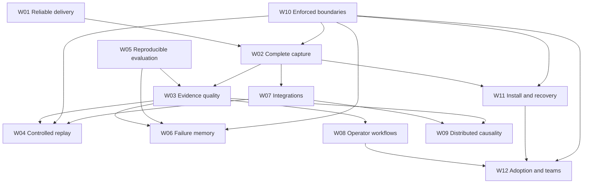

# Peaky Peek roadmap

**Last verified: 2026-09-20. Source: local and remote `main` at `f832204`.
Latest release: v0.4.0 at `5a807cf`; later commits are not part of that release.**

This is the single source of priorities for the repository. It contains the
ambitious development plans as workstreams, with their current state, dependencies
and acceptance gates. Research notes provide evidence; they do not create a
second queue. Older plans remain historical.

The proposed destination is a local-first agent investigation workbench: capture
what happened, inspect evidence, identify a plausible cause, reproduce a bounded
part of the run, and turn a verified correction into a regression case. Shared
hosting and advanced automation are later extensions of that complete workflow.

## Read this first

- [Verified implementation snapshot](guides/progress.md)
- [Latest delivery follow-up](research/2026-09-20-delivery-followup.md) and
  [PR #325 review](reports/2026-09-20-pr325-review.md)
- Evidence: [SDK and replay](research/2026-09-19-core-status.md),
  [intelligence and benchmarks](research/2026-09-19-intelligence-status.md),
  [platform and UI](research/2026-09-19-platform-status.md),
  [delivery and external research](research/2026-09-20-planning-evidence.md)
- [Milestone reconciliation](#existing-milestones-reconciled)
- [Twelve development plans](#development-plans)
- [First implementation queue](#first-implementation-queue)
- [Next delivery slices](#next-delivery-slices)
- [Phases and capacity](#phases-and-capacity)
- [Research backlog](#research-experiments-reconciled)

### Status rules

| Label | Meaning |
|---|---|
| **DONE** | The named, bounded capability exists in the inspected source and has supporting tests or an artifact. Does not imply every deployment mode was exercised. |
| **PARTIAL** | Useful implementation exists, but an integration, correctness, evaluation or operational requirement remains. |
| **NOT STARTED** | No implementation of the stated scope was found in the inspected relevant modules. This is not a claim about every branch or external service. |
| **UNVERIFIED** | Evidence is insufficient to establish the claim; an accepted ADR, screenshot, passing unit test or open PR alone is insufficient. |
| **BLOCKED** | Execution priority overlay: a prerequisite currently prevents reliable delivery or release. |
| **READY** | Scheduling overlay: prerequisites for the next bounded slice are met; implementation/review is still pending. |

`[x]` means a completed bounded deliverable; `[ ]` means remaining work. Estimates,
performance targets and adoption thresholds below are **proposals**, not measured
baselines or deadlines. The original capability audit inspected `3597b6b` and
pre-existing working-tree changes. This refresh verifies the subsequent committed
CI, contract and benchmark fixes and subsequent delivery changes. The latest
selection passed 86 tests; main CI passed while the separate secret scan failed. Historical audit findings remain scoped to their recorded
revision unless updated here. A browser session, installed artifacts and a
production deployment were not exercised in this refresh. See the
[latest delivery evidence](research/2026-09-20-delivery-followup.md) for commands,
results, skipped Redis checks and scope limits.

## Verified baseline and urgent gaps

| Capability | Status | What exists / what remains | Evidence |
|---|---|---|---|
| Typed trace events, decisions, checkpoints and manual recording | **DONE** | Implemented SDK model and recording primitives; reliability of delivery is a separate scope | [Core audit](research/2026-09-19-core-status.md) |
| SDK configuration, decorators and framework hooks | **PARTIAL** | Explicit endpoint/no-key delivery is implemented and tested (Q09); adapter semantic coverage and installed-package onboarding remain | [Delivery follow-up](research/2026-09-20-delivery-followup.md) |
| HTTP event/checkpoint ingestion | **PARTIAL** | Real persistence path exists; auth, ownership and privacy coverage are incomplete | [Platform audit](research/2026-09-19-platform-status.md) |
| Delivery recovery | **PARTIAL** | Retry/cancellation/partial-write recovery exists; memory queues are not crash-durable | [DISCOVERIES](../DISCOVERIES.md), [core audit](research/2026-09-19-core-status.md) |
| Session audit, claim verification, evidence graph and narratives | **DONE** | Deterministic analysis surfaces exist; real-world correctness and calibrated probabilities are not established | [Intelligence audit](research/2026-09-19-intelligence-status.md) |
| Goal drift, success-flow advisory and trust bands | **DONE** | Bounded heuristics implemented; efficacy remains an experiment | [Intelligence audit](research/2026-09-19-intelligence-status.md) |
| Event replay, filtering, comparison and recorded-event stepping | **DONE** | Inspection of recorded events; no general agent runtime continuation | [Core audit](research/2026-09-19-core-status.md) |
| Semantic restore through the server API | **DONE** | Copies prefix with remapped references, restore marker and checkpoint | [Core audit](research/2026-09-19-core-status.md) |
| SDK-to-server restore integration | **DONE 2026-09-20** | SDK POSTs the semantic restore contract with auth, adopts returned ids/provenance, legacy fallback for old servers; runtime continuation remains NOT STARTED (W04) | [Core audit](research/2026-09-19-core-status.md), Q10 |
| Adapter execution continuation / cached tool replay | **NOT STARTED** | New runtime contract needed beyond restored data | [Core audit](research/2026-09-19-core-status.md) |
| Failure memory, cross-session clusters and replay ranking | **PARTIAL** | Implemented components; effectiveness, isolation and retention lifecycle are incomplete | [Intelligence](research/2026-09-19-intelligence-status.md), [platform](research/2026-09-19-platform-status.md) |
| Multi-agent coordination and policy/refusal inspection | **PARTIAL** | Data models, analyses and views exist; distributed causal completeness and validated interpretation remain | [Intelligence audit](research/2026-09-19-intelligence-status.md) |
| Who&When benchmark | **PARTIAL** | Corrected protocol shipped 2026-09-20: global upstream indexing, exact independent/joint/abstention metrics with denominators, pinned-commit fetch, validated annotations, versioned result manifest (`benchmarks/results/who_when/2026-09-20-global-protocol.json`). Remaining: native-engine attribution is a separate unevaluated claim | [Intelligence audit](research/2026-09-19-intelligence-status.md), [CHANGELOG](../CHANGELOG.md) |
| Conformal uncertainty as a product guarantee | **UNVERIFIED** | Core calibration utilities exist, but research API paths include confidence-derived heuristics; do not advertise fitted guarantees | [Intelligence audit](research/2026-09-19-intelligence-status.md) |
| Auth / tenant isolation / redaction everywhere | **DONE for the audited surface** | Q06+Q08 complete: tenant-scoped clusters, checkpoint ownership AND event/session consistency, absent-key 401 in cloud mode, authenticated analytics, one-policy redaction across sinks with sentinel tests, real hosted-startup e2e green. Remaining (separate scopes): tenant-scoped analytics store, SSE cursor recovery | [Platform audit](research/2026-09-19-platform-status.md), [inventory](hosted-route-inventory.md) |
| Safe custom breakpoint predicates | **PARTIAL** | `eval` replaced by a constrained interpreter in `730d1dc`; invalid conditions are still accepted at creation/import, and evaluation budgets need completion | [Delivery follow-up](research/2026-09-20-delivery-followup.md#q07-validate-before-changing-state) |
| Redis-backed operation | **PARTIAL** | Constructor/URL wiring repaired 2026-09-20 with bounded queues, reconnect and documented durability limits; real-service verification pending where redis-server is available | [Platform audit](research/2026-09-19-platform-status.md), [Q13](#first-implementation-queue) |
| SDK/server packaging and bundled UI | **PARTIAL** | Separate package definitions and publish workflow exist; clean installed-artifact and container proof needed | [Platform audit](research/2026-09-19-platform-status.md) |
| Browser regression workflows | **NOT STARTED** for seeded full browser coverage | API e2e and component tests exist; they do not prove a browser workflow or hosted auth enforcement | [Platform audit](research/2026-09-19-platform-status.md) |
| Main CI | **RECOVERED 2026-09-20** | #324 fixed (`09ec3dc`) and closed. Q02's three consecutive green matrices: `423ab82` (35479465055), `07efd4e` (35479673383), `2e45fe7` (35479946771); `f9dc240` also passed (35480122316). Covers Python 3.10/3.11/3.12 with `-k "not integration"`, coverage, contract checks, frontend build/tests and dependency security; advisory checks remain nonblocking | [Delivery evidence](research/2026-09-20-planning-evidence.md#delivery-refresh-after-the-fixes) |
| Latest repository workflows | **MIXED / SCAN FIX VERIFIED LOCALLY** | `f832204` CI passed (35483421378); Gitleaks failed (35483421310) on one synthetic fixture. Exact fingerprints pass the failed range in two scanner versions; new GitHub evidence and a separate 19-finding historical baseline remain open | [Delivery follow-up](research/2026-09-20-delivery-followup.md#secret-scan-diagnosis-and-local-correction) |
| Type checks and API contracts | **PARTIAL** | Contract gate committed in `ac819c0` and green: 8 response field sets, 3 enum unions, 72 frontend routes, plus mutation regressions. Runtime payload types/nullability remain Q04; Pyright remains advisory | [Delivery evidence](research/2026-09-20-planning-evidence.md#delivery-refresh-after-the-fixes) |
| OTel interoperability | **PARTIAL** | Exporter setup exists; native event-to-span wiring and inbound ingestion not established | [Core audit](research/2026-09-19-core-status.md) |
| Teams, hosted accounts, billing and paid adoption | **NOT STARTED / UNVERIFIED** | Product surfaces absent in inspected app; actual customer adoption not measured | [Platform](research/2026-09-19-platform-status.md), [research](research/2026-09-20-planning-evidence.md) |

### First release gates

1. **Delivery:** Q01/Q02 recovery is complete. Deliver the locally verified
   secret-scan correction; refresh #325 after its passing local review (Q03), then obtain
   required PR checks. Payload contract extension remains Q04.
2. **Trust boundary:** scope every hosted route, checkpoint write, live stream and
   derived store. The interpreter replacement is delivered; complete predicate
   creation/import validation and resource bounds (Q07).
3. **Truthful evaluation:** ~~correct Who&When indexing/metrics and separate its
   standalone heuristic from the native audit engine; repair its broken self-test.~~
   Done 2026-09-20 (Q05). Native-engine attribution evaluation (E1) remains open.
4. **First useful run:** exercise a no-key local SDK session and restore from a
   clean installed package through the UI; close the actual wiring gaps.

These are concrete gaps found in this audit, not speculative prerequisites for
all local development. Shared-hosting work waits for the corresponding boundary
gates; local investigation improvements can continue.

## Existing milestones reconciled

The previous M1–M3 IDs are retained so existing references still make sense.

| ID | Original deliverable | Verified status and remaining scope |
|---|---|---|
| M1.1 | Deterministic goal-drift series | **DONE** as a heuristic; benchmark precision/recall is open under W03/W05 |
| M1.2 | Success-flow deviation advisory | **DONE** as advisory; effectiveness study open |
| M1.3 | Who&When external validation | **CORRECTED 2026-09-20**: protocol now follows the pinned upstream conventions (global indexing, exact independent/joint/abstention metrics, zero invalid annotations, versioned manifest). The deterministic text-marker heuristic measures 26.6% agent / 15.2% step / 15.2% joint / 46.7% abstentions; native-engine attribution remains separate and unevaluated (W05/E1) |
| M1.4 | Stakes line and named trust bands | **DONE** as a UI/engine feature; bands are not calibrated safety guarantees |
| M2.1 | Minimal re-execution set | **DONE** as a recommendation endpoint; execution of that set is future W04 work |
| M2.2 | Failure narratives | **DONE**: structured narrative and UI block; operator usefulness still to measure |
| M2.3 | Semantic checkpoint restore | **DONE** for server API and SDK integration (`e61f04d`, Q10); browser flow and runtime continuation remain separate |
| M2.4 | Seeded corpus plus UI smoke workflows | **PARTIAL**: seed/fetch scripts and API scenarios exist; browser smoke suite still open |
| M3.1 | Service decomposition | **DONE** for session-analysis/causal/similarity split; further decomposition only when needed |
| M3.2 | Cross-session clustering and retention tiers | **PARTIAL**, not greenfield: clustering and scoring exist; deletion/archive lifecycle and hosted isolation remain |
| M3.3 | Cloud/auth and end-to-end isolation | **PARTIAL / BLOCKED** by demonstrated boundary and deployment gaps |
| M3.4 | Type-check debt to zero | **PARTIAL**: advisory gate; environment-qualified current count in platform note replaces stale ~280 claim |
| M3.5 | Redaction on every ingestion/persistence path | **PARTIAL**: persisted events are filtered; checkpoint, live-buffer and metadata coverage need explicit policy/tests |

## Development plans

The following plans are intentionally broad. Each begins with one usable vertical
slice and expands only when its gate passes. Owner labels are responsibilities,
not assignments to people who have not agreed to the work.

### W01 — Reliable delivery and bounded automation

**Current:** PARTIAL; delivery recovered 2026-09-20 (Q01/Q02). Review, payload
contracts, typing and automation remain. **Priority:** P1.
**Owner:** maintainer / quality.

**Outcome:** a failed check identifies a real regression; automation extends an
existing issue/PR rather than generating repeated copies of blocked work.

- [x] Classify the failed secret scan on `f832204`: one synthetic redaction
  fixture. Exact historical fingerprints pass the failed range with Gitleaks
  8.24.3 and 8.30.1; new-commit negative controls still fail; 43 redaction tests pass.
  [Diagnosis and local correction](research/2026-09-20-delivery-followup.md#secret-scan-diagnosis-and-local-correction).
- [ ] Deliver the local scan correction and record a passing GitHub run. Resolve
  the separate 19-finding historical fixture baseline without blanket exclusions.
  Main CI success and a passing range scan do not imply clean full history.
- [x] Capture worker ID, database URL, engine lifecycle and schema state on the
  failing xdist path; reproduce before choosing a fixture or application fix.
  *(Done 2026-09-20: reproduced locally 100% with `-n auto`; three stacked root
  causes — a lifespan unit test leaking a `/tmp/test.db` engine into
  module-global `app_context`, a conftest dual-import rewriting the DB URL
  mid-worker, and cross-process temp-dir sharing — all fixed; `-n 1` plus
  twelve consecutive `-n auto` full runs green. See
  [DISCOVERIES](../DISCOVERIES.md).)*
- [ ] Reconcile #323 as superseded: its worker-variable correction landed in
  `09ec3dc` alongside the broader Q01 fix. The open PR needs tracker cleanup,
  not another implementation of that correction.
- [ ] Reconcile #321/#322/#325 and review one threshold-resolution implementation
  after CI recovery. Record infrastructure blockers separately from code findings.
  *(Local review complete: #325 covers #311; 38 alert tests, 100% targeted coverage
  and Ruff pass. [Review notes](reports/2026-09-20-pr325-review.md); updated PR-head
  CI, merge and tracker reconciliation remain.)*
- [x] Commit API-contract field/enum/route checks and prove drift fails CI.
  *(Done in `ac819c0`; live Pydantic fields, TypeScript AST extraction, mutation
  regressions and corrected frontend calls. Fresh check: 8 schemas, 3 enums,
  72 routes, no drift.)*
- [ ] Extend the committed contract gate to representative serialized response
  payloads, structural types, required fields and nullability (Q04).
- [ ] Add changed-code typing protection, then retire the environment-qualified
  debt baseline in increments; make zero-debt pyright blocking when reached.
- [ ] Give automatic work an issue lease, existing-PR lookup, base-CI preflight,
  retry budget and a durable reason for stopping after repeated identical failure.

**Next slice:** deliver the verified scan correction and confirm CI; review and
consolidate existing threshold-test PRs (Q03), then
extend payload contracts (Q04). Initial worker diagnosis is complete.
**Gate:** affected scenarios pass in the full serial and bounded-parallel suites;
three consecutive CI matrices pass after the fix, with no weakened assertions or
coverage threshold. **Met 2026-09-20**; see the linked run evidence. This is a
release heuristic, not a proof of no future flake. Follow-up typing and automation
remain open even though delivery is unblocked.
**Dependencies:** none. **Estimate:** Q03 S; Q04 M; estimate automation separately.

### W02 — Complete capture and accountable delivery

**Current:** PARTIAL. **Priority:** P0/P1. **Owner:** SDK / ingestion.

**Outcome:** an operator can tell whether a session is complete and what delivery
failure occurred, without destabilizing the instrumented application.

- [x] Separate explicit destination selection from presence of an API key;
  no-key delivery and disabled/no-endpoint controls pass (`bd37ce0`, Q09).
- [ ] Consolidate auto-patch and async transport delivery contracts: auth, timeouts,
  status handling, bounded queues, shutdown drain and per-run context.
- [ ] Define acknowledgement semantics and idempotency keys for events/checkpoints;
  distinguish accepted, durably stored, dropped and retryable outcomes.
- [ ] Add session completeness metadata: expected/received counts when available,
  missing parents, duplicate IDs, truncation, redaction and delivery warnings.
- [ ] Introduce opt-in bounded disk spooling after the delivery contract is stable;
  replay pending batches after process restart with explicit retention and quotas.
- [ ] Version event envelopes and preserve source IDs/order across imports and
  restore; document ordering under concurrent producers and clock skew.

**Delivered first slice:** explicit no-key endpoint → collector → persisted event
→ query, including offline/disabled behavior. Next, unify delivery contracts and
acknowledgement semantics; installed-artifact proof is Q12.
**Gate:** cancellation, partial write, restart, duplicate retry and quota cases
have explicit outcomes; zero silent loss among durably acknowledged test events.
**Dependencies:** W01 for regression confidence, W10 for privacy before spooling.
**Estimate:** 2–4 engineer-weeks; durable spool is a separate later slice.

### W03 — Evidence quality and defensible explanations

**Current:** existing features DONE; validated diagnosis PARTIAL.
**Priority:** P1. **Owner:** analysis / evaluation.

**Outcome:** every diagnostic claim exposes its supporting events, rule version,
missing evidence and uncertainty; unsupported claims can be rejected by users.

- [ ] Distinguish recorded, inferred and unavailable graph edges; measure missing
  parents, uncited claims, stale evidence and contradictory records.
- [ ] Persist analysis provenance: input event-set identity, analysis version,
  policy version and invalidation condition when a late event arrives.
- [ ] Separate severity, evidence support, source confidence and outcome; never
  reinterpret a heuristic trust score as probability that an action is safe.
- [ ] Connect native audit evaluation to a labeled held-out trace corpus; report
  per-failure-class results, abstentions and counterexamples.
- [ ] Add operator adjudication for a disputed diagnosis and feed reviewed labels
  into datasets without silently rewriting original evidence.
- [ ] Evaluate graph-based cause localization against simpler temporal baselines;
  retain simpler methods when they perform as well.

**First slice:** one contradicted-claim case displays exact evidence and explains
why a missing source changes its verdict; captured as a regression case.
**Gate:** every displayed finding in the reference corpus resolves to events or
an explicit missing-evidence marker; independent reviewers can reproduce verdicts.
**Dependencies:** W02 completeness, W05 dataset protocol.
**Estimate:** 2–4 engineer-weeks for first evaluated slice, then ongoing research.

### W04 — From inspection to controlled replay experiments

**Current:** inspection, server restore and SDK semantic connection DONE (Q10);
browser integration and execution continuation remain. **Priority:** P1/P2. **Owner:** SDK / runtime.

**Outcome:** inspect, restore, simulate from cached responses and execute a new
branch are separate modes with clear provenance and effects.

- [x] Route SDK restore through the server's semantic contract with configured
  authentication and returned IDs/provenance (`e61f04d`, Q10). End-to-end source
  immutability/no-execution tests pass; hosted ownership completion remains Q06.
- [ ] Show copied prefix, restore boundary, excluded outside references and new
  branch identity in the UI; compare divergent events without claiming determinism.
- [ ] Define a capability contract per adapter: inspect-only, state restore,
  cached-response simulation and live continuation.
- [ ] Implement one LangGraph continuation using its real checkpointer contract;
  unsupported adapters remain inspect-only with an explicit explanation.
- [ ] Add tool-effect classes, read-only simulation, cached tool/model responses,
  budget estimates, cancellation and explicit operator approval for live effects.
- [ ] Execute a minimal re-execution set only when dependency and effect coverage
  are known; otherwise recommend the larger safe boundary.

**Delivered first slice:** authenticated SDK restore preserves source-prefix
provenance end to end without running agent code. Next, expose that provenance
in the Q11 browser workflow; subsequent continuation uses a deterministic fixture
agent and simulated tools for one branch.
**Gate:** original run remains immutable; cache misses never silently run a tool;
new execution has its own trace, costs and effect ledger; changing one input
produces explainable divergence. Framework nondeterminism stays visible.
**Dependencies:** W02, W03, W10; W07 for adapter capability tests.
**Estimate:** 1–2 engineer-weeks for restore integration; 4–8 for first continuation.

### W05 — Reproducible benchmark and regression laboratory

**Current:** PARTIAL — protocol corrections (Q05/E0) DONE 2026-09-20;
regression-laboratory expansion remains. **Priority:** P1/P2 for expansion.
**Owner:** evaluation / quality.

**Outcome:** an incident becomes a versioned test case and a candidate fix is
compared against a reproducible baseline before release.

- [x] Correct Who&When interpretation against the pinned upstream global history
  indices; repair the self-test fixture and publish separately named agent,
  step-only, joint and abstention metrics with denominators. *(Done 2026-09-20:
  `--step-scope global` default, subprocess-tested self-test, exact
  independent/joint/abstention rates with numerators/denominators, published
  manifest at `benchmarks/results/who_when/2026-09-20-global-protocol.json`.)*
- [x] Keep the standalone error-marker heuristic separate from native
  `SessionAuditEngine`/causal evaluation; do not compare incompatible paper scores.
  *(Done: docstrings and the published manifest label the heuristic explicitly;
  paper numbers marked not-a-matched-baseline.)*
- [x] Freeze source revision, license, normalization version, dataset hash,
  evaluator version, environment and per-record predictions in result artifacts.
  *(Done 2026-09-20 for the corrected run: pinned upstream commit, corpus
  sha256 hashes, evaluator commit, metric convention, validation findings and
  frozen rows in the versioned manifest.)*
- [ ] Separate development cases, held-out cases and contamination checks;
  stratify framework/failure type and report uncertainty for small samples.
- [ ] Build incident export → redact/review → expected assertions → local runner
  → candidate comparison → inspect regressed cases as one workflow.
- [ ] Add scenario families: incomplete delivery, retry loops, stale evidence,
  conflicting agents, policy refusal, restore divergence and malformed tool output.
- [ ] Support optional model judges only after deterministic baselines, with
  pinned prompts, cost ceilings, repeated runs and human disagreement analysis.

**Next slice:** define held-out native-engine cases and their label provenance;
build incident-to-regression export under Q14 after Q08. The corrected self-test,
global-index fixtures and pinned-corpus manifest are already delivered.
**Gate:** a fresh environment reproduces published counts; every metric states its
scope and denominator; candidate and baseline share data/evaluator versions.
**Dependencies:** none for corrections; W02/W03 for native datasets; W10 for export.
**Estimate:** protocol correction complete; 3–6 engineer-weeks for regression workflow.

### W06 — Useful failure memory and adaptive investigation

**Current:** PARTIAL; do not rebuild the existing memory/ranking modules.
**Priority:** P2. **Owner:** analysis / storage.

**Outcome:** a recurring incident retrieves a relevant, verified prior correction
and explains why it applies, without leaking another workspace's data.

- [ ] Define tenant/project boundaries and version invalidation for fingerprints,
  embeddings, annotations and derived clusters.
- [ ] Add repair provenance: observed symptom, proposed correction, observed
  outcome, application/framework versions and evidence of regression prevention.
- [ ] Compare exact signatures, current vector search and hybrid retrieval on a
  labeled corpus; include misleading near-matches and rejected suggestions.
- [ ] Rank investigation/replay by estimated information gain, user effort and
  execution cost; compare to chronological order and current heuristics.
- [ ] Measure stale advice and false matches; add abstention and operator rejection.
- [ ] Coordinate memory expiry/deletion with trace retention and export; no orphaned
  embeddings or retained payloads after a requested deletion.

**First slice:** two repeated failures and one deceptive near-match produce a
reviewable match/no-match result and link to an actually verified repair.
**Gate:** held-out retrieval improves over exact-signature baseline without
cross-tenant matches; report retrieval accuracy and operator acceptance separately.
**Dependencies:** W03, W05, W10; W11 for lifecycle.
**Estimate:** 3–5 engineer-weeks for a measured reusable loop.

### W07 — Framework fidelity and open interoperability

**Current:** PARTIAL. **Priority:** P1/P2. **Owner:** SDK / integrations.

**Outcome:** supported integrations preserve enough semantics for honest debugging,
and existing tracing users can evaluate Peaky Peek without replacing their stack.

- [ ] Publish a capability matrix by framework version: sync/async, streaming,
  cancellation, nesting, tool calls, decisions, checkpoints and continuation.
- [ ] Harden LangChain/PydanticAI against actual framework lifecycle tests; treat
  CrewAI/AutoGen run-envelope wrappers as partial rather than complete adapters.
- [ ] Define a versioned OTel mapping and wire emitted trace spans; preserve source
  IDs and distinguish imported generic spans from native evidence-rich events.
- [ ] Add one inbound OTLP path with limits, auth and redaction, followed by export
  round-trip fixtures and loss-of-semantics diagnostics.
- [ ] Add TypeScript capture only after stabilizing the wire contract; start with
  one tool/agent workload, not a second full SDK architecture.
- [ ] Explore MCP tool-call visibility and a read-only investigation interface for
  coding assistants; treat trace text as data and return cited event references.

**First slice:** published matrix backed by one integration test per claimed
capability; then one native event → OTel span → imported event round trip.
**Gate:** unsupported fields/capabilities are explicit; no invented provenance;
optional integrations do not add heavyweight dependencies to the core SDK.
**Dependencies:** W02, W10; W04 for resume semantics. External mapping rationale:
[standards evidence](research/2026-09-20-planning-evidence.md).
**Estimate:** 2–3 engineer-weeks per first-class adapter; interoperability staged separately.

### W08 — Operator workflows and large-trace usability

**Current:** core panels DONE, complete browser workflows PARTIAL.
**Priority:** P1. **Owner:** frontend / product.

**Outcome:** a user can investigate a failure, understand a decision and verify a
correction without navigating an unexplained collection of panels.

- [ ] Seed browser smoke flows for session selection → audit finding → evidence
  event → checkpoint → branch/comparison, including delayed and failed requests.
- [ ] Preserve navigation/deep-link selection across reload, asynchronous loading,
  search, replay and deleted/expired sessions.
- [ ] Show capture completeness, data truncation, analysis freshness and redaction
  boundaries before presenting confident conclusions.
- [ ] Profile 10k-event sessions; virtualize measured hot lists/graphs, paginate
  server queries and provide progressively expanded subgraphs.
- [ ] Add saved investigations, annotations and compact share/export bundles after
  the local flow works; cross-user sharing waits for W10/W12.
- [ ] Verify keyboard-only operation, focus restoration, contrast, empty states,
  error recovery and reduced-motion behavior on the three core journeys.

**First slice:** a real browser opens a seeded contradicted-evidence session and
follows the finding to the correct event, then survives a delayed replay response.
**Gate:** three browser workflows run in CI; proposed reference-machine goal is
p95 useful first view under 2 seconds for 10k events, with dataset/hardware recorded.
User study target: 30% lower median diagnosis time with no reduction in correctness;
this is a hypothesis to test, not current ROI.
**Dependencies:** W01, W02/W03 metadata; W04 for actual execution UI.
**Estimate:** 2–4 engineer-weeks for smoke flows and navigation; performance by profile.

### W09 — Distributed and multi-agent causality

**Current:** PARTIAL; swimlanes and coordination analyses already exist.
**Priority:** P2/P3. **Owner:** ingestion / analysis.

**Outcome:** a cross-agent failure is explainable across process boundaries,
including missing messages, handoffs, retries and contested decisions.

- [ ] Add cross-process run/agent/task/tool-call correlation and explicit handoff
  events without assuming wall-clock order is causal order.
- [ ] Support late, duplicated and out-of-order spans; expose incomplete graph
  boundaries and how conclusions change as evidence arrives.
- [ ] Build deterministic fixtures for delegated tasks, join failures, cyclic
  delegation, conflicting policies and abandoned work.
- [ ] Connect coordination alerts to supporting handoff events and state changes;
  compare alerts to known outcomes instead of naming patterns by appearance alone.
- [ ] Add branch-local replay/counterfactual views only when execution and effect
  contracts can isolate that branch.

**First slice:** two producers send a handoff and downstream tool failure out of
order; the UI shows a correct link or an explicit unresolved dependency.
**Gate:** graph reconstruction is invariant to tested arrival permutations and
never fabricates missing edges; operator can locate first suspect handoff.
**Dependencies:** W02 ordering, W03 evidence, W05 corpus, W07 adapter semantics.
**Estimate:** 4–6 engineer-weeks for one distributed workflow.

### W10 — Enforced data boundaries and safe remote operation

**Current:** PARTIAL / BLOCKED for shared hosting.
**Priority:** P0. **Owner:** backend / security boundary maintainer.

**Outcome:** auth, ownership, privacy and execution restrictions hold at every
actual entry/exit path, including derived data and live delivery.

- [ ] Make server local/hosted mode explicit and observable; exercise the actual
  server process in hosted mode, rather than only configuring the SDK fixture.
- [x] Document route inventory and replace hard-coded cluster tenant scope (Q06).
- [ ] Enforce inventory coverage in tests; reject missing hosted credentials and
  scope or disable unauthenticated analytics reads/writes (remaining Q06).
- [x] Check checkpoint parent-session ownership (`42a6c6b`).
- [ ] Validate checkpoint event/session consistency, including same-tenant wrong
  sessions and cross-tenant event IDs before any mutation (remaining Q06).
- [x] Apply one configured policy to existing persistence/live/checkpoint/metadata
  paths (`7f95046`, Q08); sentinel boundary tests pass. Future sinks require coverage.
- [x] Replace Python `eval` with a constrained predicate interpreter (`730d1dc`).
- [ ] Validate predicates before creation/import, return clear API 4xx errors and
  bound evaluation work/result sizes (remaining Q07).
- [ ] Add bounded payload/queue/request policies, key rotation/revocation tests and
  export/delete accounting across indexes, memory, cache and audit records.

**First slice:** two hosted tenants plus unauthenticated caller exercise event,
checkpoint, replay, SSE, clustering and analytics routes with explicit outcomes.
**Gate:** documented route matrix passes against real hosted configuration;
sensitive sentinels are absent from all configured redacted outputs; custom
conditions cannot invoke server Python. Local defaults remain simple.
**Dependencies:** W01 for durable regression gates; independent of cloud billing.
**Estimate:** 2–4 engineer-weeks, adjusted after complete route inventory.

### W11 — Installable, recoverable and measured platform

**Current:** PARTIAL. **Priority:** P1, distributed scale P3.
**Owner:** platform / release.

**Outcome:** local and self-hosted installs work from built artifacts, and larger
installations have a tested recovery path before adding more infrastructure.

- [ ] Build SDK/server wheels and container in clean environments; verify CLI,
  bundled assets, first trace, health/readiness and migration lifecycle.
- [x] Fix Redis constructor/configuration wiring and document fan-out/reconnect/
  bounded-queue behavior (`e8e6696`, Q13); missed-message replay is not promised.
- [ ] Run Redis acceptance against an actual service in a job where those tests
  cannot silently skip. The latest local selection lacked the Redis dependency.
- [ ] Validate PostgreSQL driver/migrations/queries in a dedicated job; local SQLite
  tests are not proof of PostgreSQL readiness.
- [ ] Implement retention execution: dry-run eligibility → delete/archive → remove
  derived artifacts → audit outcome; scoring tiers alone do not enforce retention.
- [ ] Define backups and restore drills with proposed RPO/RTO per deployment mode;
  test recovery with a real copied dataset before publishing guarantees.
- [ ] Profile ingestion, query, analysis and UI with reproducible workload sizes;
  add background analysis workers and object storage only at measured limits.
- [ ] Introduce workload budgets, storage growth estimates and deployment health
  metrics, including dropped events and analysis lag.

**First slice:** clean wheel/container launch → trace → query → restart → same
trace, with explicit data directory and no source-tree dependency.
**Gate:** install/restart/upgrade/backup-restore paths pass; Redis/PostgreSQL modes
have real-service tests. Proposed first load target: 100 events/s for 30 minutes
on documented hardware with no loss of acknowledged events; revise after baseline.
**Dependencies:** W02 acknowledgement, W10 boundaries; W01 release signal.
**Estimate:** 2–4 engineer-weeks for install/recovery; scale follows measurements.

### W12 — Adoption, collaboration and sustainable product direction

**Current:** docs/site/examples exist; validated adoption UNVERIFIED;
team product NOT STARTED. **Priority:** P1 learning, P3 hosted features.
**Owner:** maintainer / product.

**Outcome:** developers repeatedly use the local investigation loop; collaboration
and paid features solve observed needs rather than filling an old pricing table.

- [ ] Repair quickstart and status drift; make one installation path and three
  operator workflows the maintained onboarding contract.
- [ ] Recruit a small opt-in pilot and measure time to first useful trace, repeat
  investigations, diagnosis correctness and friction; do not infer usage from stars.
- [ ] Remove or label assumed analytics savings; measure observed task time before
  presenting an ROI figure. Keep product telemetry opt-in and payload-minimal.
- [ ] Package reference integrations, failure examples and reproducible benchmark
  artifacts; publish limitations beside the demonstrations.
- [ ] Validate need for project workspaces, private sharing, review annotations,
  roles and key management; then implement one team investigation workflow.
- [ ] Revisit deployment/pricing ADR tensions with concrete pilot feedback; explore
  paid hosting, support and longer retention only after reliable self-hosting.
- [ ] Add onboarding/contribution guides, release checklists and module ownership
  to reduce maintenance concentration and attract focused contributions.

**First slice:** five developers independently follow the verified install guide
and diagnose one seeded failure; record failures as backlog evidence.
**Gate:** proposed adoption signal is at least three of five return for a second
real investigation within two weeks. If not, fix first-value and usefulness before
accounts/billing. Team/paying-user targets from old ADRs are unvalidated hypotheses.
**Dependencies:** W02/W08/W11 for onboarding; W10 before shared data.
**Estimate:** 1–2 engineer-weeks of product work plus pilot observation; team scope
estimated only after demand and identity/authorization design are concrete.

## First implementation queue

These are local planning IDs, not newly opened GitHub issues. Each is a reviewable
slice; create or reuse tracker work only when it is selected for implementation.
S/M/L are rough ranges: S ≤3 engineer-days, M 4–7, L 8–15, excluding observation.

| ID | Starting status | Slice and acceptance artifact | Depends on | Size |
|---|---|---|---|---|
| Q01 | DONE (diagnosis+fix) | #324: three lifecycle/isolation causes fixed in `09ec3dc`; serial reproducer, `-n 1` and twelve local `-n auto` runs recorded. Issue closed, verified 2026-09-20 | — | ✓ |
| Q02 | DONE | Serial green; `-n 1` + twelve local `-n auto` runs green; three consecutive fully green CI matrices (runs 35479465055, 35479673383, 35479946771) | Q01 | ✓ |
| Q03 | DONE 2026-09-20 | #325 landed via e6983ed (12 tests, reviewed in docs/reports/2026-09-20-pr325-review.md); #321/#322/#323/#309 closed with rationale, #311 closed; dependabot #307/#308/#310/#306 merged on green CI — zero open PRs | Q02 ✓ | ✓ |
| Q04 | DONE 2026-09-20 | Payload fixtures (8 core pairs, static artifact + regenerator), required/nullability and type-kind checks, 56 mutation tests; live hand-mutation flips the gate to exit 1 (`e116a49` after rebase) | Q02 ✓ | ✓ |
| Q05 | DONE (corrections) | Who&When global-index fixtures, passing self-test, named independent/joint metrics and versioned result manifest — shipped 2026-09-20 | — | ✓ |
| Q06 | DONE 2026-09-21 | All three acceptance items closed: checkpoint event/session consistency (404/422, no mutation, both ingest paths), route-inventory sync test (found+fixed 63-route doc drift), real hosted-startup e2e via AGENT_DEBUGGER_MODE=cloud with negative auth gates (`947af22`) | — | ✓ |
| Q07 | DONE 2026-09-20 | Interpreter + creation/import validation (422 at the route), bounded evaluation (repetition/concatenation caps, printf rejected), route-level and attack tests (`e7f61b2`) | — | ✓ |
| Q08 | DONE 2026-09-20 | One configured policy across persisted rows (data + metadata), buffer/SSE fan-out, checkpoint state/memory, session config and NDJSON spill; sentinel boundary tests + `scripts/scan_redaction_sinks.py` audit artifact; Python 3.10 SSE TimeoutError bug fixed en route (`7f95046`). Policy is opt-in per deployment | Q06 inventory ✓; hosted gate open | ✓ |
| Q09 | DONE 2026-09-20 | Endpoint-without-key installs unauthenticated delivery; no-endpoint/disabled inert; offline exits cleanly via failure callbacks; real-collector e2e green (`bd37ce0`). Installed-wheel onboarding command check folds into Q12 | Q02 ✓ | ✓ |
| Q10 | DONE 2026-09-20 | SDK restore POSTs the semantic contract (authenticated; unauthenticated local mode), adopts server ids and typed RestoreProvenance, legacy GET fallback marked, no execution (`e61f04d`) | Q09 ✓; Q06 hosted gate open | ✓ |
| Q11 | DONE (first slice) 2026-09-21 | scripts/browser_smoke.mjs: real headless-chromium journey — seeded contradicted finding → evidence link → correct event, restored session with visible session_restored provenance (token + source checkpoint), 1.5s delayed API response survived, zero console errors; 15 steps, verified 4× (`c51ce63`). CI wiring, multi-browser and hosted-mode journeys remain follow-ups | Q04 ✓, Q10 ✓ | ✓(local) |
| Q12 | DONE (first slice) 2026-09-20 | scripts/install_smoke.sh: both wheels built the publish.yml way, installed into a fresh venv outside the checkout; server start → keyless SDK trace → query → restart → same trace → bundled UI → same inside a Docker container with a mounted volume; two real packaging bugs fixed (alembic.ini guard, Dockerfile COPY) (`a52f40c`). CI automation of the smoke is a follow-up | Q09 ✓ | ✓(local) |
| Q13 | DONE 2026-09-20 | Code delivered (`e8e6696`) and the non-skipping real-service CI job (redis:7-alpine + redis-server binary) ran green (run 35540245616) after two test-only fixes it caught: redis-py ≥5.2 returns pubsub_numsub as a list, and the drop-oldest test raced fan-out lag (now deterministic via a drain-signal subscriber; validated 5× live) | — | ✓ |
| Q14 | NOT STARTED | Sanitized incident → immutable regression case → baseline/candidate comparison | Q05, Q08 | L |
| Q15 | PARTIAL | Adapter capability matrix with real framework tests for first supported version set | Q09 | M |
| Q16 | UNVERIFIED | Pilot first-value and diagnosis study with raw outcome counts and documented consent | Q11, Q12 | M |

Q01, Q02, Q05 and the bounded Q08/Q09/Q10 implementations are complete.
**Next order for one maintainer:** deliver W01's verified local scan correction; finish
Q03's reviewed PR handoff; close Q06/Q07 remaining acceptance; then Q04 response
contracts, Q12 installed artifacts and Q11 browser workflows. Q13 needs a real
Redis service run. Q04/Q12 can proceed independently of hosted release work.
Reuse delivered redaction, local transport and semantic restore code. Do not
restart those implementations or open duplicate PRs. Keep one delivery slice active
per maintainer; broader workstreams retain their own remaining gates.

## Next delivery slices

These briefs expand the existing queue IDs; they do not introduce another queue.
They describe planned work, not changes implemented by this documentation refresh.
Start from current main, preserve existing tests, and record the completion commit
plus a passing acceptance artifact before checking off a slice.

### Q03 — Finish one threshold-test change

**Starting point:** [#325](https://github.com/acailic/agent_debugger/pull/325),
[#322](https://github.com/acailic/agent_debugger/pull/322) and
[#321](https://github.com/acailic/agent_debugger/pull/321) add the same test file,
absent from main. [Local review of #325](reports/2026-09-20-pr325-review.md)
found no substantive blocker and passed 38 alert tests with 100% targeted coverage.
It is the selected handoff candidate, not a GitHub-approved or merged change.

1. Compare all three diffs against `collector/alerts/base.py`; retain the best
   cases in one existing PR. Check absent/empty/disabled policies, missing and
   zero-valued thresholds, forwarded arguments and sync/async getter combinations.
2. Review the sync method's async-getter fallback explicitly: it currently creates
   an unawaited coroutine. A test that closes that coroutine verifies fallback
   behavior but does not establish that the production warning is fixed.
3. Update the chosen branch against recovered main in an isolated checkout; run
   focused tests with warnings treated as errors and required CI. Old failed
   checks are not evidence about the new base.
4. After a reviewed passing merge, reconcile duplicate PRs and #311. Treat #323
   as superseded by `09ec3dc`. #324 is already closed with Q01/Q02 evidence.

**Acceptance:** one merged implementation with distinct behavior assertions,
passing required checks and an explicit warning-handling decision. Tracker
cleanup is still pending; this planning task performed no merges, comments or closures.

### Q07 — Finish validation around the delivered predicate interpreter

**Files:** `agent_debugger_sdk/core/stepper.py`, `api/stepper_routes.py`,
`frontend/src/components/StepperPanel.tsx`, and their existing tests.

**Delivered:** `730d1dc` chose the constrained-grammar option instead of disabling
custom conditions. Preserve its supported predicates; no Python `eval` remains.
The remaining work is to satisfy the original boundary and error-handling gate.

1. Validate custom conditions and numeric built-ins before core/API creation.
   Parse and validate an imported candidate state before replacing current state.
2. Convert unsupported predicates to explicit API 4xx responses and display the
   message in the existing UI. Do not wait until replay to discover invalid input.
3. Make arithmetic/sequence limits symmetric and bound aggregate work and output
   sizes. Verify rejection with a recording operator stub before any allocation;
   short expression syntax alone does not bound computation.
4. Cover built-ins, supported grammar, malformed conditions and imports through
   core and HTTP paths; assert rejected requests leave prior state unchanged.

**Acceptance:** valid predicates retain behavior; rejected creation/import causes
no state mutation; callers receive actionable errors; evaluation stays within
declared budgets. Hosted acceptance still needs Q06's actual server configuration.

### Q06 — Establish hosted identity and ownership end to end

**Files:** `auth/middleware.py`, `api/main.py`, `api/cross_session_routes.py`,
`api/analytics_routes.py`, `collector/server.py`,
`storage/repositories/checkpoint_repo.py`, and `tests/e2e/conftest.py`.

**Delivered foundation:** cluster tenant scoping, parent-session ownership,
[route inventory](hosted-route-inventory.md) and the ASGI matrix in `42a6c6b`.
Its tests explicitly preserve anonymous cloud access today. Remaining steps:

1. Define validated server-local versus hosted startup configuration independently
   of SDK credentials. Launch a real hosted subprocess with two tenant keys;
   retain a separate local/no-key positive control. Check the server's actual mode.
2. Inventory registered HTTP methods/routes and streaming/derived-data paths.
   State the intentional public allowlist. Missing, malformed, invalid and revoked
   keys must fail on protected paths. Adding a protected route without an inventory
   entry must fail the inventory check.
3. Preserve the delivered cluster repository fix. For non-tenant analytics reads
   and writes, either add tenant scope or explicitly
   make them unavailable in hosted mode until scope is implemented.
4. Validate checkpoint session ownership and referenced-event/session consistency
   before writes. Exercise read, write, export, restore, stream and derived-data
   paths with tenant A, tenant B and an unauthenticated caller.

**Acceptance:** own-tenant positive controls pass; cross-tenant operations and
inconsistent references fail without changing stored rows or emitting private
events. Record each route's expected status/visibility and actual result. Existing
API-key-positive scenarios alone do not satisfy this gate. Q08 handles redaction;
Q06 completion alone does not complete the shared-hosting release gates.

### Q09 — Make the local quickstart deliver a persisted trace

**DONE for the explicit-endpoint source workflow (`bd37ce0`).** The fresh delivery
tests pass. The steps below describe delivered scope; execute Q12 for installed
artifacts rather than reimplementing transport selection.

**Files:** `agent_debugger_sdk/config.py`,
`agent_debugger_sdk/core/context/trace_context.py`,
`agent_debugger_sdk/transport.py`, SDK/config/transport tests and `tests/e2e/`.

1. Specify transport precedence: configured in-process hooks, selected HTTP
   destination, and an explicit no-delivery mode. A missing API key must not
   prevent delivery to a selected local endpoint. Preserve existing hook isolation.
2. Use the existing HTTP transport without an Authorization header for local
   delivery. Keep authenticated delivery and concurrent context lifecycles covered.
3. Start a separate collector with a temporary database; capture a no-key SDK
   session/tool event and verify persisted session/event retrieval over HTTP.
   This establishes capture/query, not a standalone installed-SDK process or a
   no-key checkpoint/final-session-state acceptance case.
4. Cover disabled tracing, collector unavailable, shutdown/drain and bounded
   retry behavior. Show an actionable delivery failure without crashing the agent.
   Exact installed quickstart commands and the standalone SDK process are Q12;
   no-key checkpoint/final-session-state coverage remains W02 follow-up.

**Acceptance:** the documented no-key path produces queryable persisted data;
disabled tracing makes no delivery requests; offline behavior is bounded and
observable; explicit hooks are not duplicated. Keep clean-wheel proof in Q12.

### Q04 — Check the response shapes the frontend actually receives

**Starting point:** `scripts/hooks/check_api_contract.py`,
`scripts/hooks/extract_ts_contract.cjs`, `tests/contract/`,
`tests/test_api_contract.py`, and frontend API contract regressions already exist.

1. Keep the committed field/enum/route checks. Extend the existing TypeScript
   extraction, or add a bounded compile check, to retain required/optional fields,
   nullability and structural types for the named response pairs.
2. Capture real serialized session, event, checkpoint, trace, replay and search
   responses from seeded API scenarios. Include empty results, nullable parents/end
   times and nested evidence; fixtures must reflect actual HTTP serialization.
3. Validate those responses against the frontend contract. Mutate a required field,
   nullable field, scalar type and nested shape independently to prove each fails.

**Acceptance:** valid response fixtures pass; each incompatible mutation makes CI
fail with a field/type diagnostic. Existing field-name equality is not sufficient.
Expand only the named contracts before considering general client generation.

### Q12 — Verify installation independently of the source checkout

**Files:** `pyproject.toml`, `pyproject-server.toml`, `.github/workflows/publish.yml`,
`Dockerfile`, `docker-compose.yml`, `storage/engine.py`, both CLI modules and the
getting-started guide. **Prerequisite:** Q09's local transport is delivered.

1. Build SDK/server artifacts in a disposable build directory. Install each into
   a clean environment outside the checkout, with repository `PYTHONPATH` unset.
   Verify actual imports and entry points come from those installed artifacts.
2. Resolve the shared `peaky-peek` command contract for SDK-only and SDK+server
   installs. Verify supported install order, help, server startup and first trace.
3. Ensure migrations and their configuration are packaged; start with a fresh
   database, capture/query data, stop/restart and verify the same IDs survive.
   Include bundled `/ui/` assets and a health/readiness request.
4. Fix the container's missing `pyproject.toml` installation input and required
   build assets; use the project's supported Node version. Align the writable
   database directory with the non-root user's mounted persistent volume.
5. Run the exact documented onboarding commands against the artifacts. Add this
   check before publish; a successful upload is not installed behavior evidence.

**Acceptance:** SDK-only and server install paths, UI assets, trace/query/restart
and non-root container persistence pass without checkout files. Preserve logs and
artifact hashes. Do not count a source-tree import or skipped Docker run as passed.

### Q11 — Exercise the investigation journey in a real browser

**Files:** frontend API/types, investigation/replay components and session store,
`scripts/seed_demo_sessions.py`, a browser test runner and CI configuration.
**Prerequisites:** Q04 response contracts; Q10 semantic restore is delivered.

1. Start a real API/frontend pair with a deterministic seeded failure and stable
   fixture IDs. Reuse existing evidence and replay surfaces; fixture ingestion
   must use the same persistence contract as normal data.
2. Wire a visible semantic-restore action and source/copy-boundary provenance into
   the browser workflow. Confirm returned IDs reach the selected session/comparison
   state; SDK-only provenance does not establish UI completion.
3. Automate session → finding → exact evidence → checkpoint → restored branch/
   comparison. Check source immutability and copied-prefix boundaries using API
   assertions as well as visible browser content.
4. Delay trace/replay responses, reload a deep link, and return an expired/missing
   session. Verify selection, recovery messages, keyboard focus and empty states.
5. Make console exceptions and unexpected failed requests fail the job. Retain
   screenshots/browser traces on failure and stop services after each run.

**Acceptance:** three defined browser journeys pass in CI, including restored
provenance, delayed navigation and failure recovery. Keep the separate 10k-event
performance study and hosted-auth matrix out of this completion claim.

### Follow-on handoffs

| Slice | Input needed | Smallest accepted result |
|---|---|---|
| Q08 | Q06 route/identity matrix | One configured policy covers persistence, buffer/SSE, checkpoints and nested metadata; synthetic markers are absent from each forbidden sink and permitted values survive |
| Q10 | Q06 ownership + Q09 delivery | SDK uses authenticated semantic restore POST, adopts returned IDs/provenance, preserves the source and starts no agent/tool execution |
| Q11 | DONE (first slice) 2026-09-21 | scripts/browser_smoke.mjs: real headless-chromium journey — seeded contradicted finding → evidence link → correct event, restored session with visible session_restored provenance (token + source checkpoint), 1.5s delayed API response survived, zero console errors; 15 steps, verified 4× (`c51ce63`). CI wiring, multi-browser and hosted-mode journeys remain follow-ups | Q04 ✓, Q10 ✓ | ✓(local) |
| Q12 | Q09 local delivery | Build/install SDK and server wheels outside the checkout; bundled UI and trace/query/restart work; container build and writable persistent volume are verified separately |
| Q14 | Q05 reproducible protocol + Q08 export policy | A sanitized immutable incident case reproduces its expected assertions; baseline/candidate comparison pins data, app and evaluator revisions |

If a slice fails acceptance, record the failing scenario under that same ID.
Do not create a duplicate PR or reopen completed benchmark/CI diagnosis to mask
an unrelated failure. Recheck the first-value journey before starting Q16 pilots.

## Phases and capacity

Planning assumption inherited from ADR-012: **1–2 developers**. Reserve roughly
one-third of time for support, review and regression fixes. Estimates above
cannot all fit into one quarter. Dates are relative horizons from this audit,
not release commitments; sequence changes when evidence changes.

| Horizon | Proposed focus | Exit gate | Defer if gate fails |
|---|---|---|---|
| First 2–4 weeks | W01 review/contract follow-up; W10 boundary fixes; start W02 local delivery. CI recovery and benchmark correction are already complete | Preserve green delivery/evaluation; exposed unsafe paths closed or disabled | Public shared-hosting promise and new execution features |
| Weeks 5–12 | Local transport, SDK restore, installed-package proof, browser investigation flow | A clean install completes one capture → evidence → restore → comparison journey | Extra frameworks, billing and distributed infrastructure |
| Months 3–6 | Incident regression lab, measured failure memory, first supported continuation, adapter fidelity | Held-out evaluation and pilot evidence show useful improvements | More advanced models or broader automation if simpler heuristics suffice |
| Months 6–12 | Distributed causality, interoperability, retention/recovery, demand-led team workspaces | Tested boundaries/operations plus repeated team demand | Managed SaaS if privacy/operations or demand remain unproven |
| Months 12–18, contingent | Multi-language capture, controlled minimal reruns, richer collaboration and optional managed service | Sustainable maintenance and measurable advantage on real cases | Broad platform expansion without operator benefit |

**Work-in-progress limit:** one delivery slice plus one research experiment per
maintainer. Replan after each phase; choose the next slice by user value, risk
removed and confidence, not by feature count.

### Dependency map

## Research experiments reconciled

These rows refer to product experiments, not reproductions of entire papers.
Presence of similarly named code is not proof of the paper's scientific result.
[Evidence and tests](research/2026-09-19-intelligence-status.md).

| Theme / note | Current status | Existing implementation | Next bounded experiment |
|---|---|---|---|
| [Provenance survey](papers/from-agent-traces-to-trust-provenance-survey.md) | DONE advisory / PARTIAL execution | Minimal re-execution set | Measure dependency coverage and saved work before executing it; W04 |
| [Goal drift](papers/evaluating-goal-drift-in-language-model-agents.md) | DONE heuristic | Goal adherence/drift series | Labeled drift vs benign plan adaptation, precision/recall; W03/W05 |
| [Who&When](papers/who-and-when-automated-failure-attribution.md) | CORRECTED heuristic measurement | Corpus/evaluator (global protocol, versioned manifest) | Native-engine attribution on held-out traces remains open; E1 |
| [Flow of success](papers/tracing-agentic-failure-from-the-flow-of-success.md) | DONE advisory | Success-flow deviation | First useful divergence vs operator annotation; W03 |
| [Calibrated trust](papers/calibrated-trust-in-dealing-with-llm-hallucinations.md) | PARTIAL | Stakes/bands and separate calibration primitives | Coverage/reliability study on a held-out set; do not call heuristic API intervals calibrated |
| [AgentTrace](papers/agenttrace-causal-graph-tracing-for-root-cause-analysis.md) | PARTIAL | Causal/evidence graph | Missing-edge and late-event robustness with known causal graphs; W03/W09 |
| [XAI for failures](papers/xai-for-coding-agent-failures.md) | DONE explanation bundle | Failure narrative | Blind operator study of diagnosis accuracy/time; W08 |
| [FailureMem](papers/failuremem-failure-aware-autonomous-software-repair.md) | PARTIAL | Failure memory, vector search, repair events/UI | Verified-repair retrieval on held-out repeats and deceptive near-matches; W06 |
| [MSSR](papers/mssr-memory-aware-adaptive-replay.md) | PARTIAL | Ranking, time decay, replay selection | Compare information gained per inspection/cost to chronological replay; W06 |
| [Act-or-refuse](papers/learning-when-to-act-or-refuse.md) | PARTIAL | Refusal events and analysis surfaces | Label justified refusal vs unnecessary refusal separately; W03/W05 |
| [Policy-parameterized prompts](papers/policy-parameterized-prompts.md) | PARTIAL | Policy sets/diffs and events | Same task under changed policy with grounded outcome comparison; W05/W09 |
| [CXReasonAgent](papers/cxreasonagent-evidence-grounded-diagnostic-reasoning.md) | PARTIAL | Claim verification and evidence graph | Citation sufficiency metric on annotated decisions; W03 |
| [REST](papers/rest-receding-horizon-explorative-steiner-tree.md) | PARTIAL | Guided branch selection and exploration state | Compare branch inspection count to existing search; W08 |
| [NeuroSkill](papers/neuroskill-proactive-real-time-agentic-system.md) | NOT STARTED for operator-state awareness | Interaction analytics are not operator-state inference | Defer; first show opt-in workflow measurement is useful; W12 |
| [Neural debugger](papers/towards-a-neural-debugger-for-python.md) | NOT STARTED for learned pre-execution checks | Recorded-event stepper is not such a predictor | Defer until sufficient labeled cases and a simple baseline exist; W05 |

### Stop or redesign an experiment when

- It cannot beat an existing deterministic baseline on a held-out task, or its
  added cost/latency is larger than the observed operator benefit.
- It requires unavailable private data or unreviewed trace export to evaluate.
- Its headline metric changes with a different denominator or label convention;
  repair the protocol before continuing comparison.
- Operators cannot resolve a result back to evidence or disagree systematically
  with the proposed interpretation; collect adjudications before tuning scores.

## Success measures and honest reporting

| Measure | Present evidence | Proposed next measurement |
|---|---|---|
| CI reliability | Q02 gate met; `f832204` CI passes; failed scan's synthetic fixture corrected locally in two scanner versions | Confirm the correction in GitHub; retain the separate 19-finding historical baseline and excluded/advisory scope |
| First useful local trace | Q09 explicit-endpoint no-key session/event capture and HTTP query pass | Q12 clean-install commands and standalone process, then pilot timing/failure counts |
| Capture completeness | Recovery tests; no crash-durable universal guarantee | Ack/durable/drop/retry counts under declared failure injections |
| Diagnosis usefulness | Implemented heuristics and narratives | Correctness plus paired task time; report all pilot outcomes |
| Native failure-localization accuracy | Not established by Who&When helper | Held-out native traces with independently reviewed cause/step labels |
| Benchmark accuracy | Corrected global-index manifest: 49/184 exact agent, 28/184 exact step/joint, 86/184 abstentions; standalone heuristic | Held-out native-engine evaluation (E1), with versioned data and independently reviewed labels |
| Large-trace UX | No fresh browser/performance measurement in this audit | Reference machine, 10k-event data, p50/p95 navigation and memory |
| Hosting readiness | Scoped auth/privacy/runtime gaps | Real hosted-mode route matrix, recovery drill and retention deletion proof |
| Adoption/revenue | Not measured | Consenting repeat users, completed investigations and willingness-to-pay study |

Analytics click weights are estimates, not measured time saved. Test counts prove
only executed assertions. A native trace can be incomplete, and a deterministic
algorithm can still identify the wrong cause.

## Decisions, risks and scope controls

| Decision / risk | Current position | Revisit trigger |
|---|---|---|
| Local-first vs hosted architecture | Keep local workflow first; ADR-002/005/008 describe possible shared infrastructure, while ADR-003 defers pricing | Tested platform gates plus repeat team demand; record a new ADR before committing hosted product scope |
| One source of priority | This file; [ADR index](decisions/README.md) owns decision status, not delivery status | Each release and any contradictory implementation evidence |
| Queue/database expansion | Fix current paths and measure; do not deploy Redis/S3/workers solely because an old diagram names them | Measured backlog, contention or payload cost exceeds declared target |
| Replay side effects | Inspection/restore do not imply executable continuation | One adapter's effect boundary and approval path are demonstrably complete |
| Scientific claims | No causal, calibrated or safety guarantee from names or component tests | Validated protocol, held-out results and stated assumptions |
| Maintenance spread | One complete workflow before another framework or surface | Pilot demand plus sustainable compatibility-test ownership |
| Privacy vs debugging value | Explicit capture policy and missing-evidence indicators | Concrete operator need, with deletion/export and boundary tests |
| Schedule uncertainty | Ranges, gates and WIP limits; no promised ten-week SaaS launch | Phase review with measured throughput and user evidence |

Non-goals: unrestricted chain-of-thought storage; reproducing full research
training pipelines; autonomous production actions from a diagnosis; treating the
debugger as the safety enforcement system; implementing every proposed stream
before testing the main user journey.

## Shipped history and superseded plans

- 2026-09-20 (agent-team waves): Q03 tracker reconciliation (zero open PRs), Q04 payload/nullability gate, Q06 hosted-auth hardening, Q07 creation-time validation, Q08/Q10 (wave 2), Q12 install smoke with packaging fixes, Q13 real-service CI green — see earlier entry;
  plus wave 1: Q06/Q07/Q09/Q13 — hosted-boundary
  fixes with route inventory and two-tenant matrix, eval-free breakpoint predicates, no-key local
  SDK delivery, Redis buffer repair, one-policy redaction across sinks with a sentinel scan
  artifact, SDK semantic restore with provenance; Python 3.10 SSE TimeoutError bug fixed.

- 2026-09-20 (v0.4.0): benchmark-integrity and delivery-recovery release —
  corrected Who&When protocol with published manifest, real API-contract
  gate with the client fixes it caught, #324 closed with three consecutive
  green CI matrices, dependency-audit hygiene.
- 2026-09-20: xdist flake (#324/Q01) root-caused and fixed — three stacked
  causes (a lifespan unit test leaking a `/tmp/test.db` engine into
  `app_context`; a conftest dual-import rewriting the DB URL mid-worker;
  cross-process temp-dir sharing); twelve consecutive green `-n auto`
  full-suite runs locally.
- 2026-09-20: Who&When protocol correction (Q05/E0) — global upstream
  indexing, exact named metrics with denominators, repaired self-test,
  pinned-commit seeding, versioned result manifest; API-contract gate
  promoted to live-model/AST checking with mutation tests.
- 2026-09-15: Who&When corpus tooling and reported deterministic result; the audit
  above corrects the interpretation and reopens evaluation completeness.
- 2026-09-14: semantic server restore and minimal re-execution recommendation.
- 2026-08-24: failure narratives, API-level full-stack scenarios and frontend
  load/navigation fixes. Hosted auth coverage is not implied by those scenarios.
- 2026-08-15: goal drift, success-flow advisory, stakes/bands and service split.
- 2026-07: audit engine, evidence graph, portfolio and SDK telemetry utilities.

Historical theme references: [research implementation plan](research/research-implementation-plan.md),
[improvement roadmap](plans/improvement-roadmap.md),
[no-brainer plans](plans/NO_BRAINER_FEATURES_PLAN.md),
[top strategy](plans/TOP_0.1_PERCENT_STRATEGY.md),
[competitive roadmap](research/competitive-roadmap.md),
[technical possibilities](research/EDGE_OF_TECHNICAL_POSSIBILITIES.md).
Their unchecked boxes and aspirations do not override this verified inventory.

**Maintenance:** on each release, update the status and evidence of affected
rows, close queue items only when acceptance is met, refresh experiment results,
and preserve historical limitations. Add new plans as workstreams here rather
than another independent priority document.
